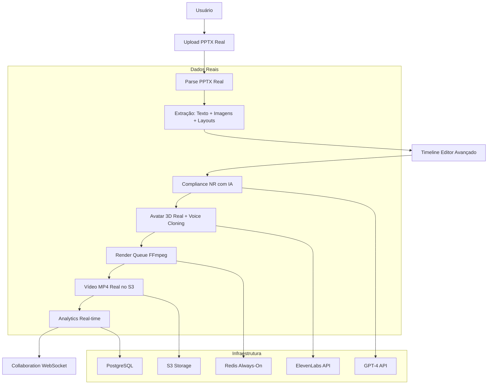
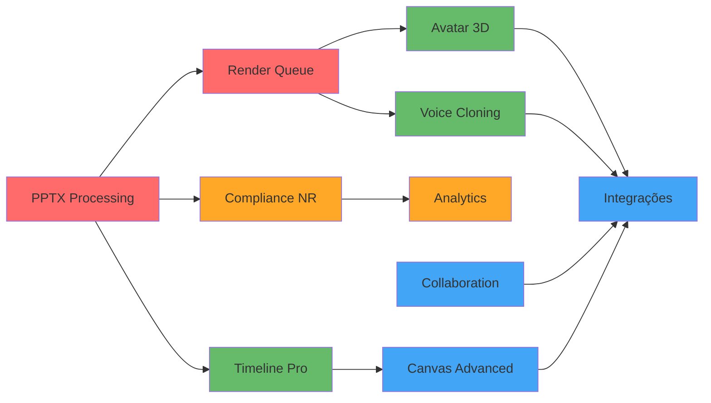

# 🎯 DOCUMENTO TÉCNICO DE IMPLEMENTAÇÃO - 100% FUNCIONAL REAL

**Documento**: Guia Técnico de Implementação Completo  
**Data**: 06/10/2025  
**Versão**: 1.0.0  
**Objetivo**: Transformar o sistema de 70-75% para 100% funcional real  
**Autor**: SOLO Document AI  

---

## 📋 ÍNDICE EXECUTIVO

1. [Análise do Estado Atual](#análise-do-estado-atual)
2. [Arquitetura de Implementação](#arquitetura-de-implementação)
3. [Plano de 10 Fases](#plano-de-10-fases)
4. [Especificações Técnicas](#especificações-técnicas)
5. [Cronograma de Implementação](#cronograma-de-implementação)
6. [Critérios de Aceitação](#critérios-de-aceitação)
7. [Riscos e Mitigação](#riscos-e-mitigação)
8. [Recursos e Infraestrutura](#recursos-e-infraestrutura)
9. [Próximos Passos](#próximos-passos)

---

## 🔍 ANÁLISE DO ESTADO ATUAL

### Score Atual: 70-75% Funcional Real

#### ✅ MÓDULOS COMPLETAMENTE FUNCIONAIS (30%)
```
Infrastructure Layer:
├─ Next.js 14 + React 18 (100%)
├─ TypeScript + ESLint (100%)
├─ Tailwind CSS + Shadcn UI (100%)
├─ Prisma ORM + PostgreSQL (100%)
├─ NextAuth.js (100%)
├─ AWS S3 Storage (100%)
├─ Redis Configuration (100%)
└─ FFmpeg Installation (100%)

Application Layer:
├─ Projects CRUD (85%)
├─ Video Player (100%)
└─ Canvas Editor Pro V3 (95%)
```

#### ⚠️ MÓDULOS PARCIALMENTE FUNCIONAIS (40%)
```
Content Processing:
├─ PPTX Upload (100%) → Processing (30%)
├─ Render Queue (40%) → Mock fallback ativo
├─ Analytics (60%) → Mix real/mock
├─ Compliance NR (40%) → Validação superficial
├─ Timeline Editor (50%) → Funcionalidade básica
├─ TTS System (90%) → Sem cache otimizado
└─ Studio Wizard (60%) → UI ok, backend mock
```

#### ❌ MÓDULOS MOCKADOS/NÃO FUNCIONAIS (30%)
```
Advanced Features:
├─ Voice Cloning (15%) → 85% mockado
├─ Real-time Collaboration (10%) → 90% mockado
├─ Avatar 3D Assets (20%) → 80% URLs fake
├─ PPTX Parsing (0%) → 100% simulação
├─ Video Rendering (10%) → Mock quando Redis falha
└─ Advanced Export (30%) → Funcionalidade básica
```

### Problemas Críticos Identificados

#### 1. PPTX Processing
```typescript
// Problema: Dados completamente fake
// Localização: app/api/v1/pptx/process/route.ts
slides.push({
  title: `Slide ${i}`,  // ❌ FAKE
  content: `Conteúdo do slide ${i}`,  // ❌ FAKE
  images: [`/api/mock/image-${i}.jpg`],  // ❌ FAKE
  notes: `Anotações do slide ${i}`,  // ❌ FAKE
})
```

#### 2. Render Queue Fallback
```typescript
// Problema: Mock quando Redis não conecta
// Localização: lib/queue/render-queue.ts
if (!redisConnected) {
  return {
    videoUrl: 'https://storage.example.com/fake.mp4', // ❌ FAKE
    duration: 120 // ❌ FAKE
  }
}
```

#### 3. Voice Cloning Mock
```typescript
// Problema: Retorna áudio fake
// Localização: lib/voice/voice-cloning.ts
return {
  audioUrl: '/api/mock/voice-sample.mp3', // ❌ FAKE
  status: 'completed' // ❌ FAKE
}
```

---

## 🏗️ ARQUITETURA DE IMPLEMENTAÇÃO

### Fluxo End-to-End Real (Objetivo Final)



### Arquitetura de Dependências



---

## 📋 PLANO DE 10 FASES

### 🔴 FASES CRÍTICAS (Semanas 1-4)

#### FASE 1: PPTX Processing Real
**Prioridade**: 🔴 CRÍTICA  
**Tempo**: 4-6 dias  
**Dependências**: Nenhuma  

**Objetivo**: Implementar parsing REAL de PPTX com extração de texto, imagens, layouts e metadados reais.

**Tasks Principais**:
1. Instalar e configurar PptxGenJS
2. Implementar parser real de texto
3. Implementar parser real de imagens → S3
4. Implementar parser de layouts
5. Refatorar API de processamento
6. Atualizar schema Prisma
7. Criar testes unitários

**Resultado**: Upload PPTX → Slides reais extraídos e salvos no DB

---

#### FASE 2: Render Queue Real
**Prioridade**: 🔴 CRÍTICA  
**Tempo**: 3-4 dias  
**Dependências**: FASE 1  

**Objetivo**: Implementar render REAL de vídeos com FFmpeg e processamento de fila com Redis.

**Tasks Principais**:
1. Garantir Redis always-on (sem fallback)
2. Implementar FFmpeg video generator
3. Criar sistema de queue real
4. Implementar upload de vídeos para S3
5. Sistema de notificações de progresso
6. Testes de render

**Resultado**: Render → Vídeo MP4 real gerado e salvo no S3

---

### 🟠 FASES IMPORTANTES (Semanas 3-4)

#### FASE 3: Compliance NR Inteligente
**Prioridade**: 🟠 IMPORTANTE  
**Tempo**: 4-5 dias  
**Dependências**: Pode ser paralelo à FASE 1-2  

**Objetivo**: Implementar validação NR real com análise semântica usando GPT-4.

**Tasks Principais**:
1. Integração com GPT-4 API
2. Criar 15+ templates NR completos
3. Implementar validador estrutural + semântico
4. Sistema de score inteligente
5. Cache de validações
6. Relatórios de compliance

**Resultado**: Validação NR real com IA e score preciso

---

#### FASE 4: Analytics Completo
**Prioridade**: 🟠 IMPORTANTE  
**Tempo**: 2-3 dias  
**Dependências**: FASE 3  

**Objetivo**: Eliminar todos os dados mock do analytics e implementar queries reais.

**Tasks Principais**:
1. Refatorar queries para dados reais
2. Dashboard sem mock data
3. Export PDF funcional
4. Export CSV funcional
5. Real-time metrics
6. Performance monitoring

**Resultado**: Analytics 100% real-time com dados do DB

---

### 🟡 FASES MÉDIAS (Semanas 5-8)

#### FASE 5: Timeline Profissional
**Prioridade**: 🟡 MÉDIA  
**Tempo**: 5-6 dias  
**Dependências**: FASE 1, FASE 2  

**Objetivo**: Implementar timeline avançada estilo Adobe Premiere.

**Tasks Principais**:
1. Keyframe animation system
2. Multi-track audio mixer
3. Effects & transitions library
4. Preview sincronizado
5. Undo/redo system
6. Timeline export/import

**Resultado**: Timeline profissional com recursos avançados

---

#### FASE 6: Avatar 3D Assets
**Prioridade**: 🟡 MÉDIA  
**Tempo**: 5-7 dias  
**Dependências**: FASE 2  

**Objetivo**: Implementar avatares 3D reais com assets no S3.

**Tasks Principais**:
1. Adquirir/criar avatares 3D
2. Upload para S3 com organização
3. Gerar thumbnails automáticos
4. Lip-sync implementation
5. Avatar customization
6. Render integration

**Resultado**: Avatares 3D reais renderizados em vídeos

---

#### FASE 7: Voice Cloning Real
**Prioridade**: 🟡 MÉDIA  
**Tempo**: 3-4 dias  
**Dependências**: FASE 2  

**Objetivo**: Implementar voice cloning real com ElevenLabs.

**Tasks Principais**:
1. Integração ElevenLabs API
2. Upload de voice samples
3. Voice training workflow
4. Audio generation real
5. Voice library management
6. Quality control

**Resultado**: Voice cloning funcional com áudio real

---

### 🟢 FASES OPCIONAIS (Semanas 9-10)

#### FASE 8: Collaboration Real-Time
**Prioridade**: 🟢 OPCIONAL  
**Tempo**: 6-8 dias  
**Dependências**: Independente  

**Objetivo**: Implementar colaboração real-time com WebSocket.

**Tasks Principais**:
1. WebSocket server (Socket.io)
2. Presença online
3. Cursor tracking
4. Operational Transform
5. Conflict resolution
6. Real-time sync

**Resultado**: Colaboração real-time funcional

---

#### FASE 9: Canvas Advanced
**Prioridade**: 🟢 OPCIONAL  
**Tempo**: 2-3 dias  
**Dependências**: FASE 5  

**Objetivo**: Completar canvas editor com features avançadas.

**Tasks Principais**:
1. Smart guides
2. Batch editing
3. Templates library
4. Advanced shapes
5. Layer management
6. Export options

**Resultado**: Canvas editor 100% profissional

---

#### FASE 10: Integrações Finais
**Prioridade**: 🟢 OPCIONAL  
**Tempo**: 3-4 dias  
**Dependências**: Todas as fases anteriores  

**Objetivo**: Integração final e polimento do sistema.

**Tasks Principais**:
1. Testes end-to-end
2. Performance optimization
3. Error handling
4. Documentation
5. Security audit
6. Production deployment

**Resultado**: Sistema 100% production-ready

---

## 🔧 ESPECIFICAÇÕES TÉCNICAS

### FASE 1: PPTX Processing - Especificação Detalhada

#### Dependências Necessárias
```bash
# Instalar dependências
yarn add pptxgenjs sharp
yarn add --dev @types/pptxgenjs @types/sharp
```

#### Estrutura de Arquivos
```
app/lib/pptx/
├── pptx-config.ts          # Configurações e tipos
├── text-parser.ts          # Parser de texto real
├── image-parser.ts         # Parser de imagens real
├── layout-parser.ts        # Detector de layouts
├── metadata-extractor.ts   # Extrator de metadados
└── pptx-processor.ts       # Orquestrador principal

app/tests/unit/pptx/
├── text-parser.test.ts
├── image-parser.test.ts
└── layout-parser.test.ts
```

#### Schema Prisma - Atualizações
```prisma
model Slide {
  id            String   @id @default(cuid())
  projectId     String
  project       Project  @relation(fields: [projectId], references: [id], onDelete: Cascade)
  
  slideNumber   Int
  title         String
  content       String   @db.Text
  notes         String?  @db.Text
  
  // Novos campos para PPTX real
  images        String[] // URLs S3
  layout        String   @default("auto")
  backgroundColor String?
  backgroundImage String?
  
  // Metadados extraídos
  wordCount     Int      @default(0)
  estimatedDuration Int  @default(5) // segundos
  extractedShapes Json?
  extractedTables Json?
  extractedCharts Json?
  
  duration      Int      @default(5)
  order         Int
  
  createdAt     DateTime @default(now())
  updatedAt     DateTime @updatedAt

  @@unique([projectId, slideNumber])
  @@index([projectId])
}
```

### FASE 2: Render Queue - Especificação Detalhada

#### Dependências Necessárias
```bash
# Dependências já instaladas
# fluent-ffmpeg, ioredis, bullmq
```

#### Estrutura de Arquivos
```
app/lib/video/
├── ffmpeg-renderer.ts      # Renderer principal
├── scene-composer.ts       # Compositor de cenas
├── audio-mixer.ts          # Mixer de áudio
├── transition-effects.ts   # Efeitos de transição
└── video-optimizer.ts      # Otimizador de vídeo

app/lib/queue/
├── redis-health.ts         # Health checker Redis
├── render-queue.ts         # Queue principal
├── job-processor.ts        # Processador de jobs
└── progress-tracker.ts     # Tracker de progresso
```

#### Configuração FFmpeg
```typescript
// Configuração otimizada para produção
const ffmpegConfig = {
  videoCodec: 'libx264',
  audioCodec: 'aac',
  videoBitrate: '2000k',
  audioBitrate: '128k',
  fps: 30,
  resolution: '1920x1080',
  preset: 'medium', // Balance entre qualidade e velocidade
  crf: 23 // Constant Rate Factor para qualidade
};
```

---

## 📅 CRONOGRAMA DE IMPLEMENTAÇÃO

### Opção A: FOCO NO CORE (4 semanas) 🔥

```
Semana 1 (5 dias úteis):
├─ FASE 1: PPTX Processing Real (4-6 dias)
└─ Início FASE 2: Render Queue Real

Semana 2 (5 dias úteis):
├─ Conclusão FASE 2: Render Queue Real
└─ Início FASE 3: Compliance NR

Semana 3 (5 dias úteis):
├─ Conclusão FASE 3: Compliance NR
└─ FASE 4: Analytics Completo

Semana 4 (5 dias úteis):
├─ Testes integrados
├─ Smoke tests
└─ Deploy production

Score Final: 85-90%
Status: Production-ready para uso real
```

### Opção B: COMPLETO (10-12 semanas) 🏢

```
Semanas 1-2: FASES 1-2 (PPTX + Render)
Semanas 3-4: FASES 3-4 (Compliance + Analytics)
Semanas 5-6: FASES 5-6 (Timeline + Avatar)
Semanas 7-8: FASES 7-8 (Voice + Collaboration)
Semanas 9-10: FASES 9-10 (Canvas + Integrações)
Semanas 11-12: Testes finais + Deploy

Score Final: 100%
Status: Enterprise-grade sem mocks
```

### Cronograma Detalhado - Semana 1

```
Segunda-feira:
├─ 09:00-12:00: Setup FASE 1 - Instalar PptxGenJS
├─ 14:00-18:00: Implementar text-parser.ts
└─ Entrega: Parser de texto básico funcionando

Terça-feira:
├─ 09:00-12:00: Implementar image-parser.ts
├─ 14:00-18:00: Integração com S3 para imagens
└─ Entrega: Extração de imagens para S3

Quarta-feira:
├─ 09:00-12:00: Implementar layout-parser.ts
├─ 14:00-18:00: Refatorar API de processamento
└─ Entrega: API processa PPTX real

Quinta-feira:
├─ 09:00-12:00: Atualizar schema Prisma
├─ 14:00-18:00: Criar testes unitários
└─ Entrega: FASE 1 completa com testes

Sexta-feira:
├─ 09:00-12:00: Smoke tests FASE 1
├─ 14:00-18:00: Início FASE 2 - Redis health
└─ Entrega: FASE 1 validada, FASE 2 iniciada
```

---

## ✅ CRITÉRIOS DE ACEITAÇÃO

### Critérios Gerais (Todas as Fases)

#### ✅ Zero Mocks
- [ ] Nenhum `mockData` no código
- [ ] Nenhum `fake-*` ou `placeholder-*`
- [ ] Todas as APIs retornam dados reais
- [ ] Nenhum fallback mock ativo

#### ✅ Fluxo End-to-End
- [ ] Upload PPTX → Parse → Render → Download MP4
- [ ] Vídeo contém imagens reais do PPTX
- [ ] Vídeo contém áudio TTS real
- [ ] Validação NR retorna score GPT-4

#### ✅ Performance
- [ ] Render < 5 min (10 slides)
- [ ] PPTX parsing < 30 seg
- [ ] Dashboard < 2 seg
- [ ] API response < 1 seg

#### ✅ Qualidade
- [ ] Build sem erros TypeScript
- [ ] Testes unitários passando (>90% coverage)
- [ ] Smoke tests OK
- [ ] Linting sem warnings

### Critérios Específicos por Fase

#### FASE 1: PPTX Processing
- [ ] Extrai texto real de slides
- [ ] Extrai imagens e salva no S3
- [ ] Detecta layouts automaticamente
- [ ] Salva metadados no banco
- [ ] Processa PPTX de 50+ slides
- [ ] Suporta imagens PNG, JPG, GIF
- [ ] Extrai speaker notes
- [ ] Calcula duração estimada

#### FASE 2: Render Queue
- [ ] Redis sempre conectado
- [ ] FFmpeg gera vídeos MP4
- [ ] Vídeos salvos no S3
- [ ] Progress tracking funcional
- [ ] Queue processa múltiplos jobs
- [ ] Notificações de conclusão
- [ ] Error handling robusto
- [ ] Cleanup de arquivos temporários

#### FASE 3: Compliance NR
- [ ] GPT-4 analisa conteúdo
- [ ] Score inteligente (0-100)
- [ ] 15+ templates NR
- [ ] Validação estrutural
- [ ] Validação semântica
- [ ] Cache de validações
- [ ] Relatórios detalhados
- [ ] Export PDF/CSV

#### FASE 4: Analytics
- [ ] Queries 100% reais
- [ ] Dashboard real-time
- [ ] Métricas de uso
- [ ] Performance tracking
- [ ] Export funcional
- [ ] Filtros avançados
- [ ] Gráficos interativos
- [ ] Alertas automáticos

---

## ⚠️ RISCOS E MITIGAÇÃO

### Riscos Técnicos

#### 1. PPTX Parsing Limitações
**Risco**: PptxGenJS pode ter limitações com PPTXs complexos  
**Probabilidade**: Média  
**Impacto**: Alto  
**Mitigação**: 
- Testar com 20+ PPTXs reais diversos
- Implementar fallback para formatos não suportados
- Considerar biblioteca alternativa (node-pptx)

#### 2. FFmpeg Performance
**Risco**: Render pode ser lento para vídeos longos  
**Probabilidade**: Alta  
**Impacto**: Médio  
**Mitigação**:
- Otimizar configurações FFmpeg
- Implementar paralelização
- Cache de assets processados
- Compressão inteligente

#### 3. GPT-4 Custos
**Risco**: Validação NR pode ser cara  
**Probabilidade**: Média  
**Impacto**: Médio  
**Mitigação**:
- Cache agressivo de validações
- Limitar validações por usuário/dia
- Usar GPT-3.5 para pré-validação
- Batch processing

#### 4. Redis Instabilidade
**Risco**: Redis pode desconectar durante render  
**Probabilidade**: Baixa  
**Impacto**: Alto  
**Mitigação**:
- Health checker robusto
- Reconnect automático
- Backup queue em DB
- Monitoring 24/7

### Riscos de Negócio

#### 1. Complexidade de Avatar 3D
**Risco**: Lip-sync pode ser muito complexo  
**Probabilidade**: Alta  
**Impacto**: Médio  
**Mitigação**:
- Usar solução pronta (D-ID, Synthesia)
- Implementar versão básica primeiro
- Considerar parceria com fornecedor

#### 2. Voice Cloning Qualidade
**Risco**: ElevenLabs pode não atender qualidade  
**Probabilidade**: Baixa  
**Impacto**: Médio  
**Mitigação**:
- Testar extensivamente
- Backup com Azure Speech
- Implementar quality scoring

---

## 💰 RECURSOS E INFRAESTRUTURA

### Custos Mensais Estimados

#### Infraestrutura Base
```
AWS S3 Storage:        $50-100/mês
Redis Cloud:           $30-60/mês
PostgreSQL:            $25-50/mês
CDN CloudFront:        $20-40/mês
────────────────────────────────
Subtotal:             $125-250/mês
```

#### APIs Externas
```
GPT-4 API:            $100-300/mês (depende do uso)
ElevenLabs Pro:       $99/mês
Azure Speech:         $50/mês (backup)
────────────────────────────────
Subtotal:             $249-449/mês
```

#### Total Estimado
```
Cenário Mínimo:       $374/mês
Cenário Médio:        $500/mês
Cenário Alto:         $699/mês
```

### Recursos de Desenvolvimento

#### Opção A: 4 semanas
```
Desenvolvedor Senior:  160-180 horas
Custo estimado:       $8,000-12,000
```

#### Opção B: 10-12 semanas
```
Desenvolvedor Senior:  400-450 horas
Custo estimado:       $20,000-30,000
```

### Infraestrutura Técnica Necessária

#### Servidor de Desenvolvimento
```
CPU: 8+ cores
RAM: 16GB+
Storage: 500GB SSD
FFmpeg: Última versão
Node.js: 18+
```

#### Servidor de Produção
```
CPU: 16+ cores
RAM: 32GB+
Storage: 1TB SSD
Load Balancer
Auto-scaling
Monitoring
```

---

## 🚀 PRÓXIMOS PASSOS

### Decisão Estratégica Necessária

Você precisa escolher uma das opções de implementação:

#### A) 🔥 FOCO NO CORE (4 semanas)
**Implementar**: FASES 1-4  
**Resultado**: 85-90% funcional real  
**Status**: Production-ready para uso real  
**Investimento**: $8,000-12,000 + $374-500/mês  

**Entregas**:
- ✅ PPTX parsing real
- ✅ Render vídeos reais
- ✅ Validação NR com IA
- ✅ Analytics real-time

#### B) 🏢 COMPLETO (10-12 semanas)
**Implementar**: FASES 1-10  
**Resultado**: 100% funcional real  
**Status**: Enterprise-grade sem mocks  
**Investimento**: $20,000-30,000 + $500-699/mês  

**Entregas**:
- ✅ Tudo da Opção A
- ✅ Timeline profissional
- ✅ Avatares 3D reais
- ✅ Voice cloning real
- ✅ Collaboration real-time
- ✅ Canvas advanced

#### C) 💡 CUSTOMIZADO
**Você escolhe** quais fases implementar  
**Resultado**: Personalizado  
**Status**: Conforme seleção  

### Checklist Pré-Implementação

#### ✅ Preparação Técnica
- [ ] Backup completo do sistema atual
- [ ] Setup ambiente de desenvolvimento
- [ ] Configurar repositório Git com branches
- [ ] Preparar ambiente de testes
- [ ] Configurar CI/CD pipeline

#### ✅ Preparação de Infraestrutura
- [ ] Configurar Redis em produção
- [ ] Verificar limites AWS S3
- [ ] Setup GPT-4 API key
- [ ] Configurar ElevenLabs account
- [ ] Preparar monitoring

#### ✅ Preparação de Equipe
- [ ] Definir responsáveis por fase
- [ ] Agendar reviews diários
- [ ] Preparar documentação
- [ ] Configurar comunicação
- [ ] Definir critérios de qualidade

### Cronograma de Início

```
Semana -1 (Preparação):
├─ Segunda: Decisão estratégica
├─ Terça: Setup infraestrutura
├─ Quarta: Preparação ambiente
├─ Quinta: Configuração APIs
└─ Sexta: Kick-off meeting

Semana 1 (Implementação):
├─ Segunda: Início FASE 1
└─ ... (conforme cronograma escolhido)
```

---

## 📚 DOCUMENTOS RELACIONADOS

### Documentação Base
- **PLANO_IMPLEMENTACAO_100_REAL.md** - Plano detalhado original
- **ROADMAP_VISUAL_100_REAL.md** - Roadmap visual e cronograma
- **INDEX_DOCUMENTACAO_COMPLETA.md** - Índice completo da documentação

### Documentação Técnica
- **BLUEPRINT_ARQUITETURA_COMPLETO.md** - Arquitetura atual
- **INVENTARIO_COMPLETO_ESTADO_ATUAL_2025.md** - Estado atual detalhado
- **FUNCIONALIDADES_REAIS_2025.md** - Funcionalidades implementadas

### Guias de Implementação
- **DEVELOPER_GUIDE.md** - Guia para desenvolvedores
- **DEPLOY_NOW.md** - Instruções de deploy
- **POST_DEPLOY_CHECKLIST.md** - Checklist pós-deploy

---

## 🎯 CONCLUSÃO

Este documento técnico fornece um roadmap completo para transformar o sistema de 70-75% para 100% funcional real. A implementação seguirá uma abordagem incremental e testada, garantindo que cada fase seja validada antes de prosseguir.

**Recomendação**: Iniciar com a **Opção A (Foco no Core)** para obter um sistema production-ready rapidamente, e depois avaliar a implementação das fases adicionais baseado no feedback dos usuários e necessidades do negócio.

**Próximo Passo**: Aguardando sua decisão sobre qual opção de implementação seguir para iniciar o processo de transformação.

---

**Documento criado por**: SOLO Document AI  
**Data**: 06/10/2025  
**Versão**: 1.0.0  
**Status**: Aguardando aprovação para implementação