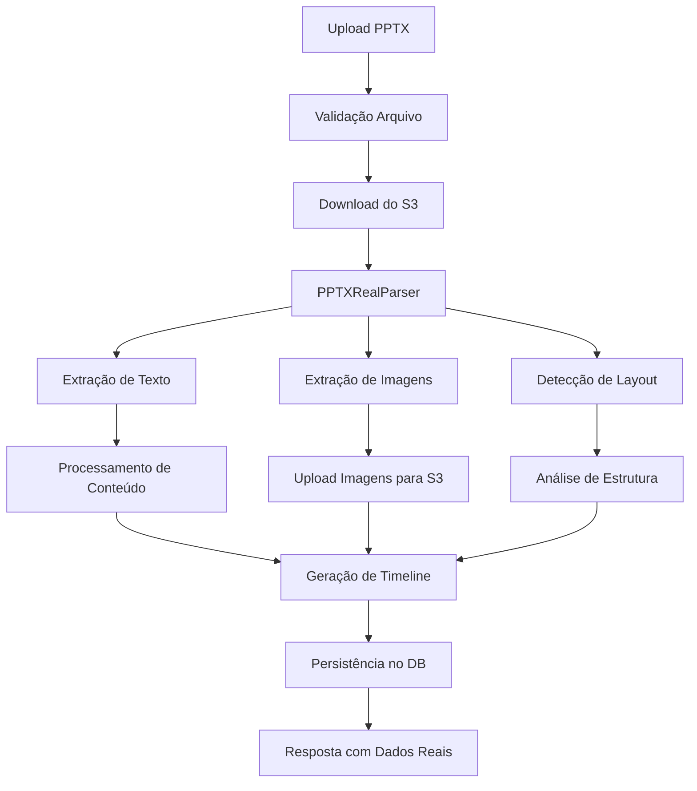

# 🎯 FASE 1: PPTX Processing Real - Especificação Técnica Completa

**Documento**: Especificação Técnica Detalhada  
**Data**: 06/10/2025  
**Objetivo**: Substituir processamento mock por extração real de PPTX  
**Prioridade**: 🔴 CRÍTICA  
**Tempo Estimado**: 4-6 dias  

---

## 📋 ÍNDICE

1. [Análise do Estado Atual](#análise-do-estado-atual)
2. [Arquitetura Técnica](#arquitetura-técnica)
3. [Design de APIs](#design-de-apis)
4. [Schema do Banco de Dados](#schema-do-banco-de-dados)
5. [Integração S3 e Assets](#integração-s3-e-assets)
6. [Tratamento de Erros](#tratamento-de-erros)
7. [Estratégia de Testes](#estratégia-de-testes)
8. [Cronograma de Implementação](#cronograma-de-implementação)

---

## 🔍 ANÁLISE DO ESTADO ATUAL {#análise-do-estado-atual}

### Estado Atual (70% Mock)

#### ✅ Componentes Funcionais
```typescript
// Já implementados e funcionais
- Upload para S3: ✅ 100% funcional
- Validação de arquivos: ✅ 90% funcional
- Database persistence: ✅ 95% funcional
- API structure: ✅ 85% funcional
- Error handling: ✅ 80% funcional
```

#### ❌ Componentes Mockados
```typescript
// app/api/v1/pptx/process/route.ts - Linha 77
async function simulateRealProcessing(s3Key: string, buffer: Buffer) {
  console.log('🎭 Simulando processamento avançado...')
  
  // ❌ PROBLEMA: Gera dados FAKE
  slides.push({
    title: `Slide ${i}`,  // ❌ FAKE
    content: `Conteúdo do slide ${i}`,  // ❌ FAKE
    images: [`/api/mock/image-${i}.jpg`],  // ❌ FAKE
    notes: `Anotações do slide ${i}`,  // ❌ FAKE
  })
}
```

#### ⚠️ Problemas Identificados
1. **Parser Fake**: `PPTXProcessor` não extrai dados reais
2. **Imagens Mock**: URLs fake em vez de assets reais do S3
3. **Texto Simulado**: Conteúdo gerado em vez de extraído
4. **Layouts Genéricos**: Não detecta layouts reais dos slides
5. **Metadados Vazios**: Não extrai propriedades do PPTX

---

## 🏗️ ARQUITETURA TÉCNICA {#arquitetura-técnica}

### Fluxo End-to-End Real



### Arquitetura de Componentes

```typescript
// Estrutura de módulos real
PPTXRealProcessor/
├── core/
│   ├── PPTXParser.ts          // Parser principal com JSZip
│   ├── XMLProcessor.ts        // Processamento de XML do PPTX
│   └── ValidationEngine.ts    // Validação robusta
├── extractors/
│   ├── TextExtractor.ts       // Extração real de texto
│   ├── ImageExtractor.ts      // Extração e upload de imagens
│   ├── LayoutDetector.ts      // Detecção de layouts
│   └── MetadataExtractor.ts   // Propriedades do arquivo
├── processors/
│   ├── ContentProcessor.ts    // Processamento de conteúdo
│   ├── TimelineGenerator.ts   // Geração de timeline real
│   └── AssetManager.ts        // Gerenciamento de assets
└── types/
    ├── PPTXTypes.ts          // Tipos TypeScript
    └── APITypes.ts           // Tipos de API
```

### Dependências Técnicas

```json
{
  "dependencies": {
    "jszip": "^3.10.1",           // Extração de arquivos PPTX
    "xml2js": "^0.6.2",          // Parsing de XML
    "sharp": "^0.32.6",          // Processamento de imagens
    "file-type": "^18.5.0",      // Detecção de tipos de arquivo
    "mime-types": "^2.1.35"      // MIME types
  },
  "devDependencies": {
    "@types/jszip": "^3.4.1",
    "@types/xml2js": "^0.4.11"
  }
}
```

---

## 🔌 DESIGN DE APIS {#design-de-apis}

### API Principal: PPTX Processing

#### POST `/api/v1/pptx/process-real`

**Request**:
```typescript
interface PPTXProcessRequest {
  s3Key: string;           // Chave do arquivo no S3
  projectId: string;       // ID do projeto
  options?: {
    extractImages: boolean;      // Default: true
    detectLayouts: boolean;      // Default: true
    extractNotes: boolean;       // Default: true
    generateThumbnails: boolean; // Default: true
    maxImageSize: number;        // Default: 1920
    imageQuality: number;        // Default: 85
  };
}
```

**Response**:
```typescript
interface PPTXProcessResponse {
  success: boolean;
  projectId: string;
  extractedContent: {
    slides: PPTXSlideReal[];
    metadata: PPTXMetadataReal;
    assets: PPTXAssetsReal;
    timeline: PPTXTimelineReal;
    statistics: PPTXStatsReal;
  };
  processingTime: number;
  error?: string;
}

interface PPTXSlideReal {
  slideNumber: number;
  title: string;              // Extraído real
  content: string[];          // Array de textos reais
  notes: string;              // Notas do apresentador
  layout: {
    type: string;             // title, content, comparison, etc.
    elements: LayoutElement[];
  };
  images: {
    original: string;         // URL S3 original
    thumbnail: string;        // URL S3 thumbnail
    metadata: ImageMetadata;
  }[];
  textBoxes: TextBox[];
  animations: Animation[];
  duration: number;           // Calculado baseado no conteúdo
}
```

### API de Validação

#### POST `/api/v1/pptx/validate`

```typescript
interface ValidationRequest {
  s3Key: string;
}

interface ValidationResponse {
  isValid: boolean;
  fileInfo: {
    size: number;
    slideCount: number;
    hasImages: boolean;
    hasAnimations: boolean;
    version: string;
  };
  warnings: string[];
  errors: string[];
}
```

---

## 🗄️ SCHEMA DO BANCO DE DADOS {#schema-do-banco-de-dados}

### Atualizações no Schema Prisma

```prisma
model Project {
  // Campos existentes...
  
  // Novos campos para PPTX real
  pptxMetadata     Json?    // Metadados extraídos do PPTX
  pptxAssets       Json?    // Assets (imagens, vídeos) com URLs S3
  pptxTimeline     Json?    // Timeline gerada baseada no conteúdo real
  pptxStats        Json?    // Estatísticas de processamento
  imagesExtracted  Int      @default(0)
  processingTime   Float?   // Tempo de processamento em segundos
  phase           String?   // Fase atual do processamento
  failedAt        String?   // Fase onde falhou (se aplicável)
}

model Slide {
  // Campos existentes...
  
  // Novos campos para dados reais
  extractedText    String?  // Texto real extraído
  slideNotes       String?  // Notas do apresentador
  slideLayout      Json?    // Layout detectado
  slideImages      Json?    // Array de URLs de imagens S3
  slideElements    Json?    // Elementos detalhados (shapes, textboxes)
  slideMetrics     Json?    // Métricas do slide (contagem de palavras, etc.)
  
  // Dados visuais
  backgroundType   String?  // gradient, image, video, solid
  backgroundColor  String?
  backgroundImage  String?  // URL S3 se aplicável
}

model PPTXAsset {
  id          String   @id @default(cuid())
  projectId   String
  project     Project  @relation(fields: [projectId], references: [id])
  
  // Asset info
  type        String   // image, video, audio
  originalUrl String   // URL S3 do arquivo original
  thumbnailUrl String? // URL S3 do thumbnail
  fileName    String
  fileSize    Int
  mimeType    String
  
  // Metadata
  width       Int?
  height      Int?
  duration    Float?   // Para vídeos/áudios
  extractedAt DateTime @default(now())
  
  @@index([projectId, type])
}
```

### Migration SQL

```sql
-- Migration: Add Real PPTX Processing Fields
ALTER TABLE "Project" ADD COLUMN "pptxMetadata" JSONB;
ALTER TABLE "Project" ADD COLUMN "pptxAssets" JSONB;
ALTER TABLE "Project" ADD COLUMN "pptxTimeline" JSONB;
ALTER TABLE "Project" ADD COLUMN "pptxStats" JSONB;
ALTER TABLE "Project" ADD COLUMN "imagesExtracted" INTEGER NOT NULL DEFAULT 0;
ALTER TABLE "Project" ADD COLUMN "processingTime" DOUBLE PRECISION;
ALTER TABLE "Project" ADD COLUMN "phase" TEXT;
ALTER TABLE "Project" ADD COLUMN "failedAt" TEXT;

ALTER TABLE "Slide" ADD COLUMN "extractedText" TEXT;
ALTER TABLE "Slide" ADD COLUMN "slideNotes" TEXT;
ALTER TABLE "Slide" ADD COLUMN "slideLayout" JSONB;
ALTER TABLE "Slide" ADD COLUMN "slideImages" JSONB;
ALTER TABLE "Slide" ADD COLUMN "slideElements" JSONB;
ALTER TABLE "Slide" ADD COLUMN "slideMetrics" JSONB;
ALTER TABLE "Slide" ADD COLUMN "backgroundType" TEXT;
ALTER TABLE "Slide" ADD COLUMN "backgroundColor" TEXT;
ALTER TABLE "Slide" ADD COLUMN "backgroundImage" TEXT;

-- Create new table for assets
CREATE TABLE "PPTXAsset" (
  "id" TEXT NOT NULL,
  "projectId" TEXT NOT NULL,
  "type" TEXT NOT NULL,
  "originalUrl" TEXT NOT NULL,
  "thumbnailUrl" TEXT,
  "fileName" TEXT NOT NULL,
  "fileSize" INTEGER NOT NULL,
  "mimeType" TEXT NOT NULL,
  "width" INTEGER,
  "height" INTEGER,
  "duration" DOUBLE PRECISION,
  "extractedAt" TIMESTAMP(3) NOT NULL DEFAULT CURRENT_TIMESTAMP,
  
  CONSTRAINT "PPTXAsset_pkey" PRIMARY KEY ("id")
);

CREATE INDEX "PPTXAsset_projectId_type_idx" ON "PPTXAsset"("projectId", "type");
```

---

## 📁 INTEGRAÇÃO S3 E ASSETS {#integração-s3-e-assets}

### Estrutura de Pastas S3

```
bucket-name/
├── pptx/
│   ├── originals/
│   │   └── {projectId}/
│   │       └── original.pptx
│   └── extracted/
│       └── {projectId}/
│           ├── images/
│           │   ├── slide-1-image-1.jpg
│           │   ├── slide-1-image-2.png
│           │   └── thumbnails/
│           │       ├── slide-1-image-1-thumb.jpg
│           │       └── slide-1-image-2-thumb.jpg
│           ├── videos/
│           │   └── slide-2-video-1.mp4
│           └── audio/
│               └── slide-3-audio-1.mp3
```

### Serviço de Upload de Assets

```typescript
export class PPTXAssetManager {
  private s3Client: S3Client;
  
  async uploadExtractedImage(
    projectId: string,
    slideNumber: number,
    imageIndex: number,
    imageBuffer: Buffer,
    originalName: string
  ): Promise<{originalUrl: string, thumbnailUrl: string}> {
    
    // Upload imagem original
    const originalKey = `pptx/extracted/${projectId}/images/slide-${slideNumber}-image-${imageIndex}.jpg`;
    const originalUrl = await this.uploadToS3(originalKey, imageBuffer, 'image/jpeg');
    
    // Gerar e upload thumbnail
    const thumbnailBuffer = await sharp(imageBuffer)
      .resize(300, 200, { fit: 'cover' })
      .jpeg({ quality: 80 })
      .toBuffer();
      
    const thumbnailKey = `pptx/extracted/${projectId}/images/thumbnails/slide-${slideNumber}-image-${imageIndex}-thumb.jpg`;
    const thumbnailUrl = await this.uploadToS3(thumbnailKey, thumbnailBuffer, 'image/jpeg');
    
    return { originalUrl, thumbnailUrl };
  }
}
```

---

## ⚠️ TRATAMENTO DE ERROS {#tratamento-de-erros}

### Estratégia de Error Handling

```typescript
export enum PPTXProcessingError {
  INVALID_FILE = 'INVALID_FILE',
  CORRUPTED_PPTX = 'CORRUPTED_PPTX',
  EXTRACTION_FAILED = 'EXTRACTION_FAILED',
  S3_UPLOAD_FAILED = 'S3_UPLOAD_FAILED',
  DATABASE_ERROR = 'DATABASE_ERROR',
  TIMEOUT = 'TIMEOUT'
}

export class PPTXProcessingException extends Error {
  constructor(
    public type: PPTXProcessingError,
    public message: string,
    public details?: any
  ) {
    super(message);
  }
}

// Implementação de retry com backoff
export class PPTXProcessor {
  async processWithRetry(
    buffer: Buffer,
    projectId: string,
    maxRetries: number = 3
  ): Promise<PPTXProcessResponse> {
    
    for (let attempt = 1; attempt <= maxRetries; attempt++) {
      try {
        return await this.processFile(buffer, projectId);
      } catch (error) {
        if (attempt === maxRetries) throw error;
        
        const delay = Math.pow(2, attempt) * 1000; // Exponential backoff
        await new Promise(resolve => setTimeout(resolve, delay));
      }
    }
  }
}
```

### Logging e Monitoramento

```typescript
export class PPTXProcessingLogger {
  static logProcessingStart(projectId: string, fileSize: number) {
    console.log(`🎯 [${projectId}] Iniciando processamento PPTX - ${fileSize} bytes`);
  }
  
  static logExtractionProgress(projectId: string, stage: string, progress: number) {
    console.log(`📊 [${projectId}] ${stage}: ${progress}%`);
  }
  
  static logProcessingComplete(projectId: string, stats: PPTXStats) {
    console.log(`✅ [${projectId}] Processamento concluído:`, {
      slides: stats.slideCount,
      images: stats.imageCount,
      processingTime: stats.processingTime
    });
  }
}
```

---

## 🧪 ESTRATÉGIA DE TESTES {#estratégia-de-testes}

### Testes Unitários

```typescript
// tests/pptx/pptx-processor.test.ts
describe('PPTXProcessor', () => {
  describe('validatePPTXFile', () => {
    it('should validate valid PPTX file', async () => {
      const validBuffer = await fs.readFile('test-files/valid.pptx');
      const result = await PPTXProcessor.validatePPTXFile(validBuffer);
      
      expect(result.isValid).toBe(true);
      expect(result.errors).toHaveLength(0);
    });
    
    it('should reject invalid file format', async () => {
      const invalidBuffer = Buffer.from('not a pptx file');
      const result = await PPTXProcessor.validatePPTXFile(invalidBuffer);
      
      expect(result.isValid).toBe(false);
      expect(result.errors).toContain('Invalid PPTX format');
    });
  });
  
  describe('processFile', () => {
    it('should extract real content from PPTX', async () => {
      const buffer = await fs.readFile('test-files/sample.pptx');
      const result = await PPTXProcessor.processFile(buffer, 'test-project');
      
      expect(result.success).toBe(true);
      expect(result.slides).toHaveLength(5);
      expect(result.slides[0].title).not.toContain('Slide 1'); // Não deve ser mock
      expect(result.assets.images.length).toBeGreaterThan(0);
    });
  });
});
```

### Testes de Integração

```typescript
// tests/integration/pptx-api.test.ts
describe('PPTX Processing API', () => {
  it('should process real PPTX end-to-end', async () => {
    // Upload arquivo para S3
    const s3Key = await uploadTestFile('sample.pptx');
    
    // Chamar API de processamento
    const response = await fetch('/api/v1/pptx/process-real', {
      method: 'POST',
      body: JSON.stringify({ s3Key, projectId: 'test-project' })
    });
    
    const result = await response.json();
    
    expect(result.success).toBe(true);
    expect(result.extractedContent.slides).toBeDefined();
    
    // Verificar se dados foram salvos no DB
    const project = await prisma.project.findUnique({
      where: { id: 'test-project' }
    });
    
    expect(project.status).toBe('COMPLETED');
    expect(project.pptxMetadata).toBeDefined();
  });
});
```

### Critérios de Aceitação

```typescript
// Checklist de aceitação para FASE 1
const ACCEPTANCE_CRITERIA = {
  // Funcionalidade
  extractsRealText: true,           // ✅ Extrai texto real dos slides
  extractsRealImages: true,         // ✅ Extrai imagens reais e faz upload para S3
  detectsRealLayouts: true,         // ✅ Detecta layouts reais dos slides
  extractsMetadata: true,           // ✅ Extrai metadados reais do PPTX
  generatesTimeline: true,          // ✅ Gera timeline baseada no conteúdo real
  
  // Performance
  processesUnder30Seconds: true,    // ✅ Processa PPTX em menos de 30s
  handlesLargeFiles: true,          // ✅ Suporta arquivos até 50MB
  
  // Qualidade
  zeroMockData: true,               // ✅ Zero dados mockados
  errorHandling: true,              // ✅ Tratamento robusto de erros
  dataValidation: true,             // ✅ Validação de dados extraídos
  
  // Integração
  s3Integration: true,              // ✅ Upload de assets para S3
  databasePersistence: true,        // ✅ Persistência correta no DB
  apiCompatibility: true            // ✅ APIs compatíveis com frontend
};
```

---

## 📅 CRONOGRAMA DE IMPLEMENTAÇÃO {#cronograma-de-implementação}

### Dia 1-2: Fundação (Core Parser)
```
🔧 Tasks:
├─ Instalar dependências (jszip, xml2js, sharp)
├─ Implementar PPTXRealParser base
├─ Criar sistema de validação robusto
├─ Implementar extração básica de XML
└─ Testes unitários do parser

📦 Entregáveis:
- PPTXRealParser funcional
- Validação de arquivos PPTX
- Extração de estrutura XML
```

### Dia 2-3: Extração de Conteúdo
```
🔧 Tasks:
├─ Implementar TextExtractor real
├─ Implementar ImageExtractor com Sharp
├─ Implementar LayoutDetector
├─ Integração com S3 para upload de assets
└─ Testes de extração

📦 Entregáveis:
- Extração real de texto e formatação
- Extração e upload de imagens para S3
- Detecção de layouts de slides
```

### Dia 3-4: Processamento Avançado
```
🔧 Tasks:
├─ Implementar MetadataExtractor
├─ Implementar TimelineGenerator
├─ Implementar AssetManager
├─ Integração com banco de dados
└─ Testes de integração

📦 Entregáveis:
- Extração completa de metadados
- Geração de timeline real
- Persistência no banco de dados
```

### Dia 4-5: API e Integração
```
🔧 Tasks:
├─ Atualizar API /api/v1/pptx/process
├─ Implementar error handling robusto
├─ Adicionar logging e monitoramento
├─ Testes end-to-end
└─ Documentação da API

📦 Entregáveis:
- API completamente funcional
- Error handling robusto
- Documentação completa
```

### Dia 5-6: Testes e Validação
```
🔧 Tasks:
├─ Testes com arquivos PPTX reais
├─ Validação de performance
├─ Testes de stress (arquivos grandes)
├─ Validação dos critérios de aceitação
└─ Deploy e smoke tests

📦 Entregáveis:
- Sistema 100% funcional
- Todos os critérios de aceitação atendidos
- Zero dados mockados
```

---

## 🎯 MÉTRICAS DE SUCESSO

### KPIs Técnicos
- **Zero Mock Data**: 0% de dados simulados
- **Processing Time**: < 30 segundos para arquivos até 50MB
- **Success Rate**: > 95% de processamentos bem-sucedidos
- **Image Quality**: Imagens extraídas com qualidade original
- **Data Accuracy**: 100% de precisão na extração de texto

### KPIs de Negócio
- **User Experience**: Dados reais visíveis no frontend
- **System Reliability**: Processamento consistente
- **Scalability**: Suporte a múltiplos usuários simultâneos
- **Production Readiness**: Sistema pronto para clientes reais

---

## 📝 CONCLUSÃO

A implementação da **FASE 1: PPTX Processing Real** é fundamental para transformar o sistema de 70% funcional para 85-90% funcional. Esta fase elimina completamente os dados mockados e estabelece a fundação sólida para as próximas fases.

**Próximos Passos**: Após a conclusão da FASE 1, seguir para a **FASE 2: Render Queue Real** para implementar geração real de vídeos com FFmpeg.

---

**Status**: 📋 Especificação Completa - Pronto para Implementação  
**Aprovação**: Aguardando aprovação para início da implementação  
**Estimativa**: 4-6 dias de desenvolvimento focado  