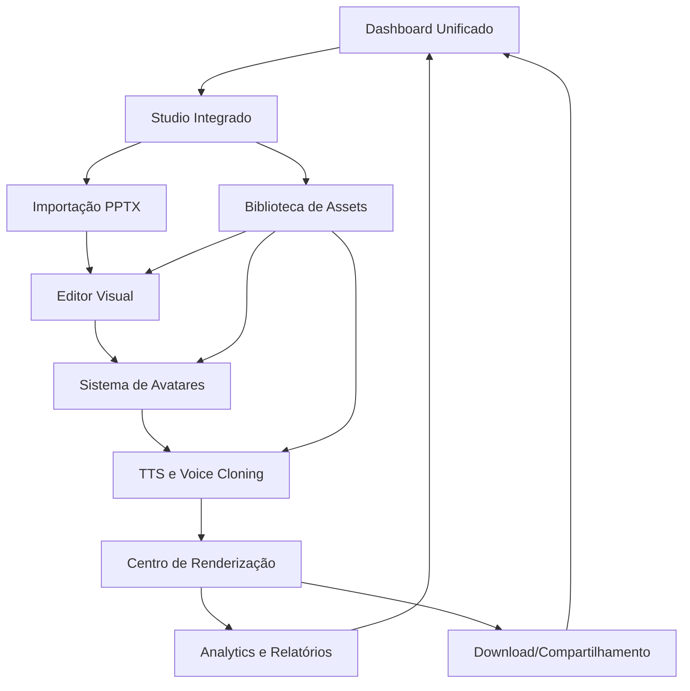

# 🎯 PRD - Sistema Integrado Unificado de Criação de Vídeos

## 1. Product Overview

**Estúdio IA Vídeos** é uma plataforma integrada que permite aos usuários criar vídeos profissionais a partir de apresentações PowerPoint, combinando edição avançada, avatares 3D hiper-realistas e síntese de voz em um fluxo de trabalho contínuo e unificado. O sistema elimina a necessidade de ferramentas separadas, oferecendo uma experiência completa desde a importação até a exportação final.

O produto resolve o problema da fragmentação de ferramentas de criação de vídeo, permitindo que educadores, treinadores corporativos e criadores de conteúdo produzam vídeos de alta qualidade com avatares 3D e narração profissional em uma única plataforma integrada.

O sistema visa capturar o mercado de e-learning corporativo e educacional, com potencial de receita de R$ 50M+ no primeiro ano através de assinaturas empresariais e licenças educacionais.

## 2. Core Features

### 2.1 User Roles

| Role | Registration Method | Core Permissions |
|------|---------------------|------------------|
| Usuário Básico | Email + senha ou OAuth (Google/Microsoft) | Importar PPTX, editar conteúdo básico, usar avatares padrão, exportar até 5 vídeos/mês |
| Usuário Premium | Upgrade via pagamento | Acesso completo a avatares 3D, voice cloning, templates avançados, exportação ilimitada |
| Administrador | Convite interno | Gerenciar usuários, analytics avançados, configurações do sistema, moderação de conteúdo |
| Usuário Corporativo | Licença empresarial | Colaboração em equipe, branding personalizado, analytics corporativos, integração SSO |

### 2.2 Feature Module

O sistema integrado consiste nas seguintes páginas principais:

1. **Dashboard Unificado**: centro de controle principal, projetos recentes, analytics em tempo real, acesso rápido a todas as funcionalidades.
2. **Studio Integrado**: ambiente único de criação com importação PPTX, editor visual, timeline avançada, configuração de avatares e TTS.
3. **Biblioteca de Assets**: galeria de avatares 3D, vozes sintéticas, templates NR, elementos visuais e efeitos.
4. **Centro de Renderização**: monitoramento de processamento, fila de render, preview em tempo real, controle de qualidade.
5. **Analytics e Relatórios**: métricas de engajamento, relatórios de compliance NR, performance de vídeos, insights de audiência.

### 2.3 Page Details

| Page Name | Module Name | Feature description |
|-----------|-------------|---------------------|
| Dashboard Unificado | Visão Geral | Exibir projetos ativos, estatísticas de uso, progresso de renders, notificações em tempo real |
| Dashboard Unificado | Acesso Rápido | Botões para novo projeto PPTX, novo projeto do zero, templates NR, biblioteca de assets |
| Dashboard Unificado | Analytics Real-time | Gráficos de performance, métricas de engajamento, relatórios de compliance, exportações recentes |
| Studio Integrado | Importação PPTX | Upload drag-and-drop, processamento automático, extração de conteúdo, preview de slides |
| Studio Integrado | Editor Visual | Canvas avançado com layers, timeline multi-track, edição de texto e imagens, efeitos visuais |
| Studio Integrado | Sistema de Avatares | Galeria 3D interativa, personalização facial, configuração de posicionamento, preview em tempo real |
| Studio Integrado | TTS e Voice Cloning | Síntese de voz com múltiplas vozes, clonagem de voz personalizada, sincronização labial automática |
| Studio Integrado | Configuração de Render | Qualidade de vídeo, formato de saída, configurações avançadas, estimativa de tempo |
| Biblioteca de Assets | Avatares 3D | Galeria com categorias (executivo, educador, técnico), preview interativo, favoritos |
| Biblioteca de Assets | Vozes e TTS | Biblioteca de vozes por idioma e gênero, samples de áudio, configurações de velocidade |
| Biblioteca de Assets | Templates NR | Templates de compliance para NR12, NR33, NR35, estruturas pré-definidas |
| Centro de Renderização | Fila de Processamento | Status de renders ativos, estimativas de tempo, controle de prioridade, cancelamento |
| Centro de Renderização | Preview e Qualidade | Player integrado, controle de qualidade automático, aprovação antes da finalização |
| Centro de Renderização | Download e Compartilhamento | Links de download, compartilhamento direto, integração com storage, histórico de exports |
| Analytics e Relatórios | Métricas de Projeto | Tempo de criação, taxa de conclusão, feedback de qualidade, performance de renders |
| Analytics e Relatórios | Compliance NR | Validação automática com IA, relatórios de conformidade, sugestões de melhoria |
| Analytics e Relatórios | Insights de Audiência | Dados de visualização, engajamento, retenção, feedback dos usuários finais |

## 3. Core Process

### Fluxo Principal do Usuário

O usuário inicia no **Dashboard Unificado**, onde visualiza todos os projetos e pode criar um novo projeto. Ao selecionar "Novo Projeto PPTX", é direcionado ao **Studio Integrado** onde faz upload da apresentação. O sistema processa automaticamente o PPTX, extraindo textos, imagens e layouts, apresentando os slides na timeline.

No **Editor Visual**, o usuário personaliza o conteúdo, adiciona efeitos e configura a narrativa. Em seguida, acessa o **Sistema de Avatares** para escolher e personalizar um avatar 3D, definindo posicionamento e expressões. No módulo **TTS e Voice Cloning**, seleciona ou cria uma voz sintética, configurando velocidade e entonação.

Após finalizar a edição, o usuário configura o render no **Centro de Renderização**, escolhendo qualidade e formato. O sistema processa o vídeo em background, permitindo acompanhar o progresso em tempo real. Uma vez concluído, o vídeo fica disponível para download, compartilhamento e análise no módulo **Analytics e Relatórios**.

### Fluxo de Navegação

## 4. User Interface Design

### 4.1 Design Style

**Cores Primárias**: Azul profissional (#1e40af), Verde sucesso (#16a34a), Cinza neutro (#64748b)
**Cores Secundárias**: Laranja destaque (#ea580c), Roxo criativo (#7c3aed), Vermelho alerta (#dc2626)

**Estilo de Botões**: Rounded corners (8px), gradientes sutis, estados hover com elevação, animações de 200ms
**Tipografia**: Inter para interface (14px-24px), Roboto Mono para código (12px-16px), hierarquia clara com weights 400-700
**Layout**: Grid system responsivo, sidebar fixa, header com breadcrumbs, cards com shadow elevation
**Ícones**: Lucide React com estilo outline, tamanho 16px-24px, cores consistentes com o tema
**Animações**: Framer Motion para transições, loading states com skeleton, micro-interações suaves

### 4.2 Page Design Overview

| Page Name | Module Name | UI Elements |
|-----------|-------------|-------------|
| Dashboard Unificado | Header Principal | Logo, navegação global, perfil do usuário, notificações em tempo real com badge counter |
| Dashboard Unificado | Cards de Projeto | Grid responsivo 3x2, thumbnails de preview, status badges, progress bars, ações rápidas |
| Dashboard Unificado | Analytics Widget | Gráficos Chart.js, métricas em tempo real, cores de status, animações de contadores |
| Studio Integrado | Toolbar Superior | Breadcrumbs, ações de projeto (salvar, exportar), preview toggle, configurações rápidas |
| Studio Integrado | Sidebar Esquerda | Navegação entre módulos, collapse/expand, ícones intuitivos, indicadores de progresso |
| Studio Integrado | Canvas Central | Área de trabalho principal, zoom controls, grid overlay, rulers, selection tools |
| Studio Integrado | Timeline Inferior | Multi-track timeline, drag-and-drop, zoom temporal, markers, playback controls |
| Biblioteca de Assets | Grid de Avatares | Cards 4x3 responsivos, hover effects com preview 3D, filtros por categoria, search bar |
| Biblioteca de Assets | Player de Voz | Waveform visualization, play/pause controls, speed adjustment, volume slider |
| Centro de Renderização | Fila de Jobs | Lista com status icons, progress bars animadas, tempo estimado, ações de controle |
| Centro de Renderização | Preview Player | Video player customizado, quality selector, fullscreen mode, frame-by-frame navigation |

### 4.3 Responsiveness

O sistema é **desktop-first** com adaptação completa para tablets (768px+) e mobile (375px+). A interface utiliza breakpoints responsivos com sidebar colapsável em telas menores, navigation drawer para mobile, e touch optimization para interações em dispositivos móveis. O canvas editor adapta-se com zoom automático e controles touch-friendly para edição em tablets.