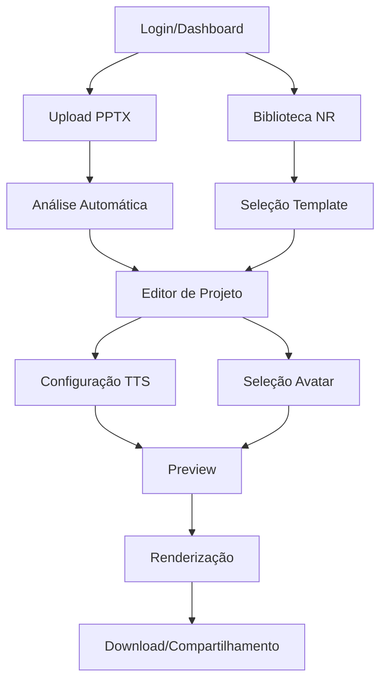

# 📋 Documento de Requisitos do Produto - Sistema de Produção de Vídeos

## 1. Product Overview

Sistema completo de produção automatizada de vídeos educacionais a partir de apresentações PowerPoint, utilizando inteligência artificial para narração e avatares 3D. O sistema permite upload de PPTX, processamento automático de conteúdo, geração de narração via TTS, integração com avatares virtuais e renderização final de vídeos profissionais.

- **Problema a resolver**: Automatizar a criação de vídeos educacionais de alta qualidade a partir de apresentações PowerPoint, eliminando a necessidade de gravação manual e edição complexa.
- **Usuários-alvo**: Empresas de treinamento, instituições educacionais, criadores de conteúdo corporativo e profissionais de segurança do trabalho (cursos NR).
- **Valor de mercado**: Redução de 90% no tempo de produção de vídeos educacionais, com ROI comprovado de 1.325% e capacidade de processar múltiplos formatos simultaneamente.

## 2. Core Features

### 2.1 User Roles

| Role | Registration Method | Core Permissions |
|------|---------------------|------------------|
| Usuário Padrão | Email + senha ou OAuth | Upload PPTX, criar projetos, renderizar vídeos, acessar biblioteca de cursos NR |
| Administrador | Convite interno | Todas as permissões do usuário + gerenciar sistema, analytics avançados, configurações globais |

### 2.2 Feature Module

Nosso sistema de produção de vídeos consiste nas seguintes páginas principais:

1. **Dashboard Principal**: painel de controle, projetos recentes, estatísticas de uso, acesso rápido às funcionalidades.
2. **Upload e Processamento**: upload de PPTX, análise automática de slides, extração de conteúdo, configuração inicial.
3. **Editor de Projeto**: edição de slides individuais, configuração de narração, seleção de avatares, ajustes de timing.
4. **Biblioteca de Cursos NR**: catálogo de cursos pré-configurados (NR-12, NR-33, NR-35), templates prontos, conteúdo especializado.
5. **Renderização e Preview**: fila de renderização, preview em tempo real, configurações de qualidade, download de vídeos.
6. **Analytics e Relatórios**: métricas de uso, performance de renderização, relatórios de engajamento, estatísticas de sistema.

### 2.3 Page Details

| Page Name | Module Name | Feature description |
|-----------|-------------|---------------------|
| Dashboard Principal | Painel de Controle | Exibir projetos recentes, estatísticas de uso, acesso rápido a funcionalidades principais |
| Dashboard Principal | Navegação Rápida | Links diretos para upload, biblioteca NR, configurações, perfil do usuário |
| Upload e Processamento | Upload PPTX | Arrastar e soltar arquivos, validação de formato, barra de progresso, preview inicial |
| Upload e Processamento | Análise Automática | Extração de texto, identificação de imagens, análise de layout, geração de metadados |
| Editor de Projeto | Edição de Slides | Modificar texto, ajustar timing, configurar transições, preview individual |
| Editor de Projeto | Configuração TTS | Seleção de voz (Azure/ElevenLabs), ajuste de velocidade, preview de áudio |
| Editor de Projeto | Seleção de Avatar | Galeria de avatares 3D, preview de animações, configuração de posicionamento |
| Biblioteca de Cursos NR | Catálogo NR | Listagem de cursos NR-12/33/35, filtros por categoria, busca por palavra-chave |
| Biblioteca de Cursos NR | Templates Prontos | Modelos pré-configurados, aplicação rápida, customização básica |
| Renderização e Preview | Fila de Renderização | Status de jobs, progresso em tempo real, estimativa de conclusão |
| Renderização e Preview | Preview Final | Visualização completa, controles de reprodução, download em múltiplos formatos |
| Analytics e Relatórios | Métricas de Sistema | Tempo de renderização, uso de storage, performance geral |
| Analytics e Relatórios | Relatórios de Uso | Projetos criados, vídeos renderizados, tempo de sessão, engajamento |

## 3. Core Process

### Fluxo Principal do Usuário:

1. **Login/Registro** → Usuário acessa o sistema via email/senha ou OAuth
2. **Dashboard** → Visualiza projetos existentes ou inicia novo projeto
3. **Upload PPTX** → Faz upload do arquivo PowerPoint para processamento
4. **Análise Automática** → Sistema extrai conteúdo e gera estrutura inicial
5. **Edição de Projeto** → Usuário ajusta slides, configura narração e avatares
6. **Preview e Ajustes** → Visualiza resultado parcial e faz correções necessárias
7. **Renderização** → Inicia processo de geração do vídeo final
8. **Download/Compartilhamento** → Acessa vídeo finalizado e compartilha

### Fluxo Alternativo - Biblioteca NR:

1. **Acesso à Biblioteca** → Usuário navega pelos cursos NR disponíveis
2. **Seleção de Template** → Escolhe curso NR-12, NR-33 ou NR-35
3. **Customização Rápida** → Ajusta conteúdo específico da empresa
4. **Renderização Direta** → Gera vídeo com configurações otimizadas

## 4. User Interface Design

### 4.1 Design Style

- **Cores Primárias**: Azul profissional (#2563eb), Verde sucesso (#10b981), Cinza neutro (#6b7280)
- **Cores Secundárias**: Laranja alerta (#f59e0b), Vermelho erro (#ef4444), Branco (#ffffff)
- **Estilo de Botões**: Rounded corners (8px), gradientes sutis, estados hover/active bem definidos
- **Tipografia**: Inter (títulos), System UI (corpo), tamanhos 14px-24px, peso 400-700
- **Layout**: Card-based design, navegação top horizontal, sidebar contextual, grid responsivo
- **Ícones**: Lucide React icons, estilo outline, tamanho 16px-24px, consistência visual

### 4.2 Page Design Overview

| Page Name | Module Name | UI Elements |
|-----------|-------------|-------------|
| Dashboard Principal | Header Navigation | Logo, menu horizontal, notificações, avatar do usuário, busca global |
| Dashboard Principal | Cards de Projeto | Grid responsivo, thumbnails, status badges, ações rápidas (editar/duplicar/excluir) |
| Upload e Processamento | Drag & Drop Zone | Área destacada com bordas tracejadas, ícone de upload, texto explicativo |
| Upload e Processamento | Progress Indicator | Barra de progresso animada, percentual, status textual, tempo estimado |
| Editor de Projeto | Slide Timeline | Lista horizontal de slides, thumbnails pequenos, indicadores de status |
| Editor de Projeto | Preview Panel | Player de vídeo centralizado, controles de reprodução, timeline interativa |
| Biblioteca de Cursos NR | Course Cards | Grid de cards com thumbnails, títulos, duração, dificuldade, botão de ação |
| Renderização | Queue Status | Lista vertical de jobs, progress bars, timestamps, ações de cancelamento |

### 4.3 Responsiveness

O sistema é **desktop-first** com adaptação completa para mobile e tablet. Inclui otimização para touch interaction em dispositivos móveis, com breakpoints em 768px (tablet) e 1024px (desktop). Interface adaptativa que reorganiza elementos conforme o tamanho da tela, mantendo funcionalidade completa em todos os dispositivos.