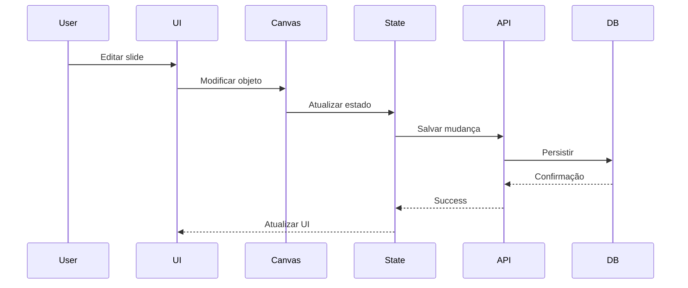

# 🔧 Melhorias para o Documento do Plano de Evolução

> **Análise crítica** do documento PLANO_EVOLUCAO_EDITOR_PROFISSIONAL.md
> **Data:** 15 de Outubro de 2025

---

## 📋 Sumário de Melhorias

### ✅ O que o documento tem de BOM:
1. Estrutura clara em fases
2. Código de exemplo prático
3. Justificativas técnicas
4. Estimativas realistas
5. Análise de bibliotecas

### ❌ O que FALTA (crítico):
1. Estratégia de testes
2. Plano de rollback/contingência
3. Observabilidade e monitoramento
4. Gerenciamento de estado
5. Estratégia de migration/rollout
6. Documentação técnica ongoing
7. Onboarding de desenvolvedores
8. Diagrams/visualizações

---

## 🎯 Melhorias Críticas (Prioridade ALTA)

### 1. Adicionar Seção de Testes

**Onde inserir:** Após cada fase

```markdown
## 🧪 Estratégia de Testes - Fase 1

### Pirâmide de Testes

```
        E2E (10%)
       /          \
    Integration (30%)
   /                \
  Unit Tests (60%)
```

### Fase 1: MVP
**Objetivo:** Garantir fluxo básico funciona

#### Testes Unitários (Jest)
```typescript
// __tests__/lib/slides/index.test.ts
describe('listSlides', () => {
  it('should return slides ordered by order_index', async () => {
    const slides = await listSlides('project-id');
    expect(slides).toHaveLength(3);
    expect(slides[0].order_index).toBe(0);
  });
});
```

**Cobertura mínima:** 70%
**Tempo de execução:** < 30s
**CI/CD:** Bloquear merge se falhar

#### Testes de Integração
```typescript
// __tests__/integration/upload-flow.test.ts
describe('Upload Flow', () => {
  it('should upload PPTX and create project', async () => {
    const file = new File([pptxBuffer], 'test.pptx');
    const result = await uploadPPTX(file);

    expect(result.projectId).toBeDefined();
    expect(result.slides).toHaveLength(5);
  });
});
```

#### Testes E2E (Playwright)
```typescript
// e2e/critical-path.spec.ts
test('complete video creation flow', async ({ page }) => {
  await page.goto('/upload');
  await page.setInputFiles('input[type=file]', 'test.pptx');
  await page.click('button:has-text("Upload")');

  await expect(page).toHaveURL(/\/editor\?projectId=/);

  await page.fill('[data-testid="slide-title"]', 'New Title');
  await page.click('button:has-text("Save")');

  await page.click('button:has-text("Render")');

  await expect(page.locator('.render-status')).toHaveText('Completed', {
    timeout: 120000
  });
});
```

### Fase 2: Editor Profissional

#### Performance Tests
```typescript
// __tests__/performance/canvas.test.ts
describe('Canvas Performance', () => {
  it('should render at 60 FPS with 100 objects', async () => {
    const canvas = createTestCanvas();

    for (let i = 0; i < 100; i++) {
      canvas.add(new fabric.Rect({ width: 50, height: 50 }));
    }

    const fps = await measureFPS(canvas, 5000);
    expect(fps).toBeGreaterThan(55); // 60 FPS ideal, 55 mínimo
  });
});
```

#### Visual Regression (Chromatic/Percy)
```typescript
// stories/Canvas.stories.tsx
export const WithMultipleLayers: Story = {
  args: {
    layers: [
      { type: 'text', content: 'Hello' },
      { type: 'rect', width: 200, height: 100 }
    ]
  }
};
```

**Setup:**
```bash
npm install --save-dev @storybook/addon-a11y chromatic
npx chromatic --project-token=<token>
```

### Fase 3 & 4: Testes Avançados

#### Load Testing (Artillery)
```yaml
# artillery.yml
config:
  target: 'http://localhost:3000'
  phases:
    - duration: 60
      arrivalRate: 10
      name: "Warm up"
    - duration: 300
      arrivalRate: 50
      name: "Sustained load"

scenarios:
  - name: "Video render flow"
    flow:
      - post:
          url: "/api/render"
          json:
            projectId: "{{ projectId }}"
      - think: 5
      - get:
          url: "/api/render/{{ $randomString() }}/status"
```

#### Chaos Engineering (opcional)
```typescript
// Simular falhas de rede, latência, etc
import { simulateNetworkFailure } from '@chaos/testing';

test('should handle Supabase downtime gracefully', async () => {
  simulateNetworkFailure({ service: 'supabase', duration: 5000 });

  const result = await uploadPPTX(file);
  expect(result.error).toContain('retry');
});
```

---

## 2. Adicionar Plano de Rollback e Contingência

**Onde inserir:** Após "Riscos e Mitigações"

```markdown
## 🔄 Plano de Rollback e Contingência

### Princípios
1. **Feature Flags:** Todas as features novas atrás de flags
2. **Database Migrations:** Sempre reversíveis
3. **Canary Releases:** 5% → 25% → 50% → 100%
4. **Monitoring:** Alertas automáticos de degradação

### Rollback por Fase

#### Fase 1: MVP
**Se falhar:** CRÍTICO - não há fallback

**Sinais de falha:**
- Taxa de erro > 10%
- Render success rate < 80%
- Usuários não conseguem completar fluxo

**Ação:**
1. Pausar deploy
2. Análise de root cause (30min)
3. Fix imediato OU rollback completo
4. Post-mortem obrigatório

#### Fase 2: Editor Profissional
**Se falhar:** Rollback para editor básico (Fase 1)

**Feature Flags:**
```typescript
// lib/feature-flags.ts
export const FEATURES = {
  ADVANCED_CANVAS: process.env.ENABLE_ADVANCED_CANVAS === 'true',
  TIMELINE_MULTITRACK: process.env.ENABLE_MULTITRACK === 'true',
  KEYFRAME_SYSTEM: process.env.ENABLE_KEYFRAMES === 'true'
} as const;

// Uso:
if (FEATURES.ADVANCED_CANVAS) {
  return <AdvancedCanvasEditor />;
} else {
  return <BasicCanvasEditor />; // Fallback
}
```

**Database Migration Rollback:**
```sql
-- migrations/002_add_timeline_tracks.up.sql
CREATE TABLE timeline_tracks (
  id UUID PRIMARY KEY,
  project_id UUID REFERENCES projects(id),
  type TEXT NOT NULL,
  ...
);

-- migrations/002_add_timeline_tracks.down.sql
DROP TABLE IF EXISTS timeline_tracks;
```

**Rollback Checklist:**
```markdown
- [ ] Verificar se há dados na nova tabela
- [ ] Fazer backup antes de rollback
- [ ] Comunicar usuários afetados
- [ ] Desabilitar feature flag
- [ ] Reverter migration
- [ ] Validar sistema funcionando
- [ ] Post-mortem em 24h
```

#### Fase 3 & 4: Recursos Avançados
**Se falhar:** Continuar com Fase 2 (editor funcional)

**Alternativas de Bibliotecas:**
| Feature | Primária | Fallback 1 | Fallback 2 |
|---------|----------|------------|------------|
| Keyframes | Theatre.js | GSAP Timeline | Custom (básico) |
| Waveforms | Wavesurfer.js | Canvas API | Sem visualização |
| Collaboration | Yjs + Socket.io | Polling | Sem real-time |

### Procedimento de Rollback

#### 1. Detectar Problema
**Fontes:**
- Sentry alerts
- Datadog APM
- User reports
- Health checks

#### 2. Avaliar Severidade
**P0 (Crítico):** Sistema down, rollback imediato
**P1 (Alto):** Feature quebrada, rollback em 1h
**P2 (Médio):** Degradação, fix ou rollback em 4h
**P3 (Baixo):** Issue menor, fix na próxima release

#### 3. Executar Rollback
```bash
# Via Vercel/Railway
vercel rollback [deployment-url]

# Via Docker
docker-compose down
docker-compose -f docker-compose.v1.yml up -d

# Reverter migrations
npm run db:rollback
```

#### 4. Validar
```bash
# Smoke tests
npm run test:smoke

# Health check
curl https://app.com/api/health
```

#### 5. Comunicar
- [ ] Notificar equipe (Slack)
- [ ] Atualizar status page
- [ ] Comunicar clientes afetados
- [ ] Criar incident ticket

#### 6. Post-Mortem (obrigatório)
**Template:**
```markdown
# Incident Post-Mortem

## Sumário
- **Data:**
- **Duração:**
- **Impacto:**
- **Root Cause:**

## Timeline
- 10:00 - Deploy da feature X
- 10:15 - Primeiros erros no Sentry
- 10:20 - Alertas disparados
- 10:25 - Decisão de rollback
- 10:30 - Rollback completado

## O que funcionou bem
- Alertas detectaram rapidamente
- Rollback foi suave

## O que pode melhorar
- Faltaram testes de carga
- Feature flag não estava configurada

## Action Items
- [ ] Adicionar teste de carga pré-deploy
- [ ] Documentar processo de feature flags
```

---

## 3. Adicionar Observabilidade e Monitoramento

**Onde inserir:** Nova seção após "Fase 4"

```markdown
## 📊 Observabilidade e Monitoramento

### Stack de Observabilidade

```
┌─────────────────────────────────────┐
│         Frontend (Next.js)          │
│                                     │
│  ┌──────────┐  ┌──────────────┐   │
│  │  Sentry  │  │   Mixpanel   │   │
│  │ (Errors) │  │  (Analytics) │   │
│  └──────────┘  └──────────────┘   │
└─────────────────────────────────────┘
              │
              ▼
┌─────────────────────────────────────┐
│          Backend (API)              │
│                                     │
│  ┌──────────┐  ┌──────────────┐   │
│  │  Sentry  │  │   Datadog    │   │
│  │ (Errors) │  │    (APM)     │   │
│  └──────────┘  └──────────────┘   │
└─────────────────────────────────────┘
              │
              ▼
┌─────────────────────────────────────┐
│        Infrastructure               │
│                                     │
│  ┌──────────┐  ┌──────────────┐   │
│  │  Logs    │  │   Metrics    │   │
│  │(Winston) │  │ (Prometheus) │   │
│  └──────────┘  └──────────────┘   │
└─────────────────────────────────────┘
```

### 1. Logs Estruturados

**Setup Winston:**
```typescript
// lib/logger.ts
import winston from 'winston';

export const logger = winston.createLogger({
  level: process.env.LOG_LEVEL || 'info',
  format: winston.format.combine(
    winston.format.timestamp(),
    winston.format.errors({ stack: true }),
    winston.format.json()
  ),
  defaultMeta: {
    service: 'estudio-ia-videos',
    environment: process.env.NODE_ENV
  },
  transports: [
    new winston.transports.Console(),
    new winston.transports.File({
      filename: 'logs/error.log',
      level: 'error'
    }),
    new winston.transports.File({
      filename: 'logs/combined.log'
    })
  ]
});

// Uso:
logger.info('User started render', {
  userId: user.id,
  projectId: project.id,
  duration: project.duration
});
```

**Contexto de Request:**
```typescript
// middleware/logger.ts
export function loggerMiddleware(req: Request, res: Response, next: NextFunction) {
  const requestId = randomUUID();

  req.logger = logger.child({
    requestId,
    userId: req.user?.id,
    path: req.path,
    method: req.method
  });

  req.logger.info('Request started');

  res.on('finish', () => {
    req.logger.info('Request completed', {
      statusCode: res.statusCode,
      duration: Date.now() - req.startTime
    });
  });

  next();
}
```

### 2. Métricas Customizadas

**Instrumentação:**
```typescript
// lib/metrics.ts
import { Counter, Histogram, Gauge } from 'prom-client';

export const metrics = {
  renderStarted: new Counter({
    name: 'video_render_started_total',
    help: 'Total number of render jobs started',
    labelNames: ['project_id', 'user_id']
  }),

  renderDuration: new Histogram({
    name: 'video_render_duration_seconds',
    help: 'Duration of video renders',
    labelNames: ['status', 'resolution'],
    buckets: [10, 30, 60, 120, 300, 600]
  }),

  activeUsers: new Gauge({
    name: 'active_users_total',
    help: 'Number of active users in editor'
  }),

  canvasFPS: new Gauge({
    name: 'canvas_fps',
    help: 'Canvas rendering FPS',
    labelNames: ['component']
  })
};

// Uso:
metrics.renderStarted.inc({ project_id: id, user_id: userId });

const timer = metrics.renderDuration.startTimer();
await renderVideo(project);
timer({ status: 'success', resolution: '1080p' });
```

**Endpoint de Métricas:**
```typescript
// app/api/metrics/route.ts
import { register } from 'prom-client';

export async function GET() {
  const metrics = await register.metrics();
  return new Response(metrics, {
    headers: { 'Content-Type': register.contentType }
  });
}
```

### 3. Alertas e Notificações

**Alertas Críticos:**
```yaml
# alerts/production.yml
groups:
  - name: critical
    rules:
      - alert: HighErrorRate
        expr: rate(http_requests_total{status=~"5.."}[5m]) > 0.05
        for: 5m
        labels:
          severity: critical
        annotations:
          summary: "High error rate detected"

      - alert: RenderQueueBacklog
        expr: render_queue_size > 50
        for: 10m
        labels:
          severity: warning
        annotations:
          summary: "Render queue has {{ $value }} jobs pending"

      - alert: LowCanvasFPS
        expr: canvas_fps < 30
        for: 2m
        labels:
          severity: warning
        annotations:
          summary: "Canvas FPS dropped to {{ $value }}"
```

**Integração Slack:**
```typescript
// lib/alerts.ts
import { WebClient } from '@slack/web-api';

const slack = new WebClient(process.env.SLACK_TOKEN);

export async function sendAlert(alert: Alert) {
  await slack.chat.postMessage({
    channel: '#alerts',
    text: `🚨 ${alert.severity.toUpperCase()}: ${alert.summary}`,
    blocks: [
      {
        type: 'section',
        text: {
          type: 'mrkdwn',
          text: `*${alert.name}*\n${alert.description}`
        }
      },
      {
        type: 'context',
        elements: [
          {
            type: 'mrkdwn',
            text: `Severity: ${alert.severity} | Time: ${alert.timestamp}`
          }
        ]
      }
    ]
  });
}
```

### 4. Dashboards

**Grafana Dashboard JSON:**
```json
{
  "dashboard": {
    "title": "Estúdio IA - Production",
    "panels": [
      {
        "title": "Request Rate",
        "targets": [
          {
            "expr": "rate(http_requests_total[5m])"
          }
        ]
      },
      {
        "title": "Render Queue",
        "targets": [
          {
            "expr": "render_queue_size"
          }
        ]
      },
      {
        "title": "Canvas FPS",
        "targets": [
          {
            "expr": "avg(canvas_fps) by (component)"
          }
        ]
      }
    ]
  }
}
```

**Métricas de Negócio:**
- Videos criados / dia
- Tempo médio de edição
- Taxa de conversão (upload → render)
- Features mais usadas
- Tempo de render médio por resolução

---

## 4. Adicionar Gerenciamento de Estado

**Onde inserir:** Na Fase 2, antes da "Arquitetura Proposta"

```markdown
## 🗂️ Arquitetura de Estado

### Stack de Estado

```
┌─────────────────────────────────────┐
│     Server State (React Query)      │
│  - Projects, Slides, Render Status  │
└─────────────────────────────────────┘
              │
              ▼
┌─────────────────────────────────────┐
│      Client State (Zustand)         │
│  - Editor State, UI State, Canvas   │
└─────────────────────────────────────┘
              │
              ▼
┌─────────────────────────────────────┐
│      Local State (useState)         │
│  - Form inputs, Transient UI        │
└─────────────────────────────────────┘
```

### 1. Server State (React Query)

**Setup:**
```bash
npm install @tanstack/react-query
```

```typescript
// app/providers/query-provider.tsx
'use client';

import { QueryClient, QueryClientProvider } from '@tanstack/react-query';
import { ReactQueryDevtools } from '@tanstack/react-query-devtools';

const queryClient = new QueryClient({
  defaultOptions: {
    queries: {
      staleTime: 1000 * 60 * 5, // 5 minutos
      cacheTime: 1000 * 60 * 30, // 30 minutos
      retry: 3,
      refetchOnWindowFocus: false
    }
  }
});

export function QueryProvider({ children }: { children: React.ReactNode }) {
  return (
    <QueryClientProvider client={queryClient}>
      {children}
      <ReactQueryDevtools initialIsOpen={false} />
    </QueryClientProvider>
  );
}
```

**Uso:**
```typescript
// hooks/use-project.ts
import { useQuery, useMutation, useQueryClient } from '@tanstack/react-query';

export function useProject(projectId: string) {
  return useQuery({
    queryKey: ['project', projectId],
    queryFn: () => fetchProject(projectId),
    enabled: !!projectId
  });
}

export function useUpdateProject() {
  const queryClient = useQueryClient();

  return useMutation({
    mutationFn: updateProject,
    onSuccess: (data) => {
      queryClient.invalidateQueries(['project', data.id]);
    }
  });
}

// Uso em componente:
function Editor() {
  const { data: project, isLoading } = useProject(projectId);
  const updateMutation = useUpdateProject();

  const handleSave = () => {
    updateMutation.mutate({ id: projectId, ...changes });
  };
}
```

### 2. Client State (Zustand)

**Setup:**
```bash
npm install zustand immer
```

**Editor Store:**
```typescript
// stores/editor-store.ts
import create from 'zustand';
import { devtools, persist } from 'zustand/middleware';
import { immer } from 'zustand/middleware/immer';

interface EditorState {
  // Canvas
  canvas: fabric.Canvas | null;
  selectedObjects: fabric.Object[];

  // Timeline
  currentTime: number;
  isPlaying: boolean;
  zoom: number;

  // UI
  activePanel: 'layers' | 'properties' | 'assets';

  // Actions
  setCanvas: (canvas: fabric.Canvas) => void;
  selectObject: (obj: fabric.Object) => void;
  setCurrentTime: (time: number) => void;
  play: () => void;
  pause: () => void;
}

export const useEditorStore = create<EditorState>()(
  devtools(
    immer((set) => ({
      canvas: null,
      selectedObjects: [],
      currentTime: 0,
      isPlaying: false,
      zoom: 1,
      activePanel: 'layers',

      setCanvas: (canvas) => set({ canvas }),

      selectObject: (obj) => set((state) => {
        state.selectedObjects = [obj];
      }),

      setCurrentTime: (time) => set({ currentTime: time }),

      play: () => set({ isPlaying: true }),

      pause: () => set({ isPlaying: false })
    }))
  )
);

// Uso:
function TimelineControls() {
  const { isPlaying, play, pause } = useEditorStore();

  return (
    <button onClick={isPlaying ? pause : play}>
      {isPlaying ? '⏸' : '▶'}
    </button>
  );
}
```

**Undo/Redo Store:**
```typescript
// stores/history-store.ts
interface HistoryState {
  past: any[];
  present: any;
  future: any[];

  undo: () => void;
  redo: () => void;
  push: (state: any) => void;
}

export const useHistoryStore = create<HistoryState>((set) => ({
  past: [],
  present: null,
  future: [],

  undo: () => set((state) => {
    if (state.past.length === 0) return state;

    const previous = state.past[state.past.length - 1];
    const newPast = state.past.slice(0, state.past.length - 1);

    return {
      past: newPast,
      present: previous,
      future: [state.present, ...state.future]
    };
  }),

  redo: () => set((state) => {
    if (state.future.length === 0) return state;

    const next = state.future[0];
    const newFuture = state.future.slice(1);

    return {
      past: [...state.past, state.present],
      present: next,
      future: newFuture
    };
  }),

  push: (newState) => set((state) => ({
    past: [...state.past, state.present],
    present: newState,
    future: [] // Limpa future ao fazer nova ação
  }))
}));
```

### 3. Sincronização Canvas ↔ State

**Middleware:**
```typescript
// lib/canvas-sync.ts
export function syncCanvasToState(canvas: fabric.Canvas, store: EditorStore) {
  // Canvas → State
  canvas.on('selection:created', (e) => {
    store.setSelectedObjects(e.selected);
  });

  canvas.on('object:modified', (e) => {
    const state = canvas.toJSON();
    store.history.push(state);
  });

  // State → Canvas
  useEffect(() => {
    const unsubscribe = store.subscribe((state, prevState) => {
      if (state.selectedObjects !== prevState.selectedObjects) {
        canvas.setActiveObject(state.selectedObjects[0]);
        canvas.renderAll();
      }
    });

    return unsubscribe;
  }, [canvas, store]);
}
```

---

## 5. Adicionar Estratégia de Migration e Rollout

```markdown
## 🚀 Estratégia de Migration e Rollout

### Fases de Rollout

#### Fase 1: Internal Alpha (Semana 1-2)
- **Público:** Time interno (5-10 pessoas)
- **Feature Flags:** 100% habilitadas
- **Objetivo:** Validar funcionalidade básica
- **Critérios de sucesso:**
  - 0 bugs críticos
  - Fluxo completo funciona
  - Performance aceitável

#### Fase 2: Closed Beta (Semana 3-4)
- **Público:** 50 usuários selecionados
- **Feature Flags:** 100% para beta users
- **Objetivo:** Feedback real, edge cases
- **Critérios de sucesso:**
  - < 5% erro rate
  - NPS > 30
  - 80% completam fluxo

#### Fase 3: Open Beta (Semana 5-6)
- **Público:** Opt-in para todos
- **Feature Flags:** Opt-in via UI
- **Objetivo:** Validar escala
- **Critérios de sucesso:**
  - < 2% erro rate
  - NPS > 50
  - Performance mantém

#### Fase 4: General Availability (Semana 7+)
- **Público:** 100% gradual
- **Rollout:** 5% → 25% → 50% → 100%
- **Objetivo:** Launch completo
- **Monitoring:** 24/7 por 72h

### Database Migrations

**Estratégia Zero-Downtime:**

1. **Backward Compatible Changes First**
```sql
-- ✅ SAFE: Adicionar coluna nullable
ALTER TABLE projects ADD COLUMN timeline_version INTEGER;

-- ✅ SAFE: Criar nova tabela
CREATE TABLE timeline_tracks (...);

-- ❌ UNSAFE: Remover coluna (fazer depois)
-- ALTER TABLE projects DROP COLUMN old_field;
```

2. **Multi-Phase Migration**
```sql
-- Phase 1: Add new column (deploy)
ALTER TABLE projects ADD COLUMN new_field TEXT;

-- Phase 2: Backfill data (background job)
UPDATE projects SET new_field = old_field WHERE new_field IS NULL;

-- Phase 3: Make NOT NULL (next deploy)
ALTER TABLE projects ALTER COLUMN new_field SET NOT NULL;

-- Phase 4: Drop old column (deploy after)
ALTER TABLE projects DROP COLUMN old_field;
```

3. **Data Migration Script**
```typescript
// scripts/migrate-to-timeline-v2.ts
import { db } from './lib/db';

export async function migrateToTimelineV2() {
  const projects = await db.projects.findMany({
    where: { timeline_version: 1 }
  });

  console.log(`Migrating ${projects.length} projects...`);

  for (const project of projects) {
    try {
      const newTimeline = convertV1ToV2(project.timeline);

      await db.projects.update({
        where: { id: project.id },
        data: {
          timeline: newTimeline,
          timeline_version: 2
        }
      });

      console.log(`✅ Migrated project ${project.id}`);
    } catch (error) {
      console.error(`❌ Failed to migrate project ${project.id}`, error);
    }
  }
}

// Executar:
// npm run migrate:timeline-v2
```

### Feature Flags Implementation

**Biblioteca:**
```bash
npm install @vercel/flags
# ou
npm install launchdarkly-js-client-sdk
```

**Setup:**
```typescript
// lib/feature-flags.ts
import { unstable_flag as flag } from '@vercel/flags/next';

export const advancedCanvasFlag = flag({
  key: 'advanced-canvas',
  description: 'Enable advanced canvas editor',
  options: [
    { value: false, label: 'Off' },
    { value: true, label: 'On' }
  ],
  decide: ({ user }) => {
    // Lógica de decisão
    if (user.email.endsWith('@company.com')) return true; // Internal
    if (user.betaProgram) return true; // Beta users
    if (Math.random() < 0.25) return true; // 25% rollout
    return false;
  }
});

// Uso em componente:
import { advancedCanvasFlag } from '@/lib/feature-flags';

export default async function EditorPage() {
  const showAdvancedCanvas = await advancedCanvasFlag();

  return showAdvancedCanvas ? <AdvancedCanvas /> : <BasicCanvas />;
}
```

### Comunicação com Usuários

**Changelog:**
```markdown
# Changelog

## [2.0.0] - 2025-11-15

### ✨ Added
- Timeline multi-track com drag-and-drop
- Sistema de keyframes visual
- 50+ novos efeitos e transições

### 🔧 Changed
- Canvas editor completamente redesenhado
- Performance 3x mais rápida

### 🐛 Fixed
- Correção de sincronização canvas/preview
- Memory leak no render worker

### ⚠️ Breaking Changes
- Projetos antigos serão migrados automaticamente
- Backup será criado antes da migração
```

**Email para Beta Users:**
```html
<h2>🎬 Nova Versão do Editor Disponível!</h2>

<p>Olá {{name}},</p>

<p>Estamos felizes em anunciar a <strong>versão 2.0</strong> do nosso editor!</p>

<h3>Novidades:</h3>
<ul>
  <li>Timeline multi-track profissional</li>
  <li>Sistema de keyframes visual</li>
  <li>Performance 3x mais rápida</li>
</ul>

<p><a href="https://app.com/editor?beta=true">Experimentar Agora</a></p>

<p>Seu feedback é muito importante! <a href="https://forms.com/feedback">Enviar Feedback</a></p>
```

---

## 6. Adicionar Documentação Técnica Ongoing

```markdown
## 📚 Documentação Técnica

### Estrutura de Documentação

```
docs/
├── README.md                    # Visão geral
├── CONTRIBUTING.md              # Como contribuir
├── ARCHITECTURE.md              # Arquitetura do sistema
├── API.md                       # Documentação de APIs
├── DEPLOYMENT.md                # Deploy e infra
├── TROUBLESHOOTING.md           # Solução de problemas
├── guides/
│   ├── getting-started.md
│   ├── editor-usage.md
│   └── advanced-features.md
└── decisions/
    ├── 001-why-remotion.md      # ADRs
    ├── 002-canvas-vs-svg.md
    └── 003-state-management.md
```

### ADRs (Architecture Decision Records)

**Template:**
```markdown
# ADR-003: State Management com Zustand

## Status
Aceito

## Contexto
Precisamos de gerenciamento de estado para o editor com:
- Estado de canvas
- Timeline
- Undo/redo
- Sincronização

Opções consideradas:
- Redux Toolkit
- Zustand
- Jotai

## Decisão
Usar **Zustand** com middleware de immer e persist.

## Consequências

### Positivas
- API simples e intuitiva
- Bundle size pequeno (3KB)
- Performance excelente
- TypeScript first-class

### Negativas
- Menos middleware disponível que Redux
- Comunidade menor

## Alternativas
Se Zustand não escalar, migrar para Redux Toolkit.
```

### API Documentation (OpenAPI/Swagger)

```yaml
# openapi.yml
openapi: 3.0.0
info:
  title: Estúdio IA Videos API
  version: 1.0.0

paths:
  /api/projects:
    post:
      summary: Create a new project
      requestBody:
        required: true
        content:
          multipart/form-data:
            schema:
              type: object
              properties:
                file:
                  type: string
                  format: binary
      responses:
        '201':
          description: Project created
          content:
            application/json:
              schema:
                $ref: '#/components/schemas/Project'

components:
  schemas:
    Project:
      type: object
      properties:
        id:
          type: string
          format: uuid
        name:
          type: string
        slides:
          type: array
          items:
            $ref: '#/components/schemas/Slide'
```

**Gerar docs:**
```bash
npm install --save-dev swagger-ui-react
# Acessar em /api-docs
```

---

## 7. Adicionar Onboarding de Desenvolvedores

```markdown
## 👨‍💻 Onboarding de Desenvolvedores

### Semana 1: Setup e Contexto

#### Dia 1: Setup
- [ ] Clonar repositório
- [ ] Setup ambiente local
- [ ] Rodar testes
- [ ] Fazer primeiro commit

**Checklist:**
```bash
git clone repo
npm install
cp .env.example .env
npm run dev
npm test
```

#### Dia 2-3: Arquitetura
- [ ] Ler ARCHITECTURE.md
- [ ] Entender fluxo de dados
- [ ] Explorar codebase
- [ ] Pair programming com mentor

#### Dia 4-5: Primeira Task
- [ ] Task de "boas-vindas" (pequena feature)
- [ ] Code review com mentor
- [ ] Deploy em staging

### Semana 2-3: Produtividade

- [ ] Task de complexidade média
- [ ] Participar de code review
- [ ] Contribuir para docs

### Semana 4: Autonomia

- [ ] Task de complexidade alta
- [ ] Propor melhorias
- [ ] Retrospectiva de onboarding

### Recursos de Aprendizado

**Vídeos Internos:**
- Arquitetura do sistema (15min)
- Como funciona o editor (20min)
- Processo de deploy (10min)

**Mentoria:**
- Check-in diário (15min)
- Code review pair (1h/semana)
- Office hours (aberto)

---

## 8. Adicionar Diagramas e Visualizações

```markdown
## 📐 Diagramas de Arquitetura

### Diagrama de Contexto (C4)

```
┌─────────────────────────────────────────────┐
│                   User                      │
└─────────────────────┬───────────────────────┘
                      │
                      ▼
┌─────────────────────────────────────────────┐
│           Web Application                   │
│   ┌─────────────────────────────────┐      │
│   │      Editor (React/Next.js)     │      │
│   └─────────────────────────────────┘      │
│                     │                        │
│   ┌─────────────────┼─────────────────┐    │
│   │                 │                 │    │
│   ▼                 ▼                 ▼    │
│ ┌──────┐      ┌──────────┐     ┌────────┐ │
│ │Canvas│      │ Timeline │     │Preview │ │
│ └──────┘      └──────────┘     └────────┘ │
└─────────────────────┬───────────────────────┘
                      │
        ┌─────────────┼─────────────┐
        ▼             ▼             ▼
  ┌──────────┐  ┌─────────┐  ┌──────────┐
  │ Supabase │  │  Redis  │  │ Remotion │
  │(DB+Store)│  │ (Queue) │  │ (Render) │
  └──────────┘  └─────────┘  └──────────┘
```

### Fluxo de Dados



### Arquitetura de Deploy

```
┌────────────────────────────────────────┐
│           Vercel (Frontend)            │
│  ┌──────────────────────────────────┐ │
│  │   Next.js App (Edge Functions)   │ │
│  └──────────────────────────────────┘ │
└────────────────┬───────────────────────┘
                 │
         ┌───────┴────────┐
         │                │
         ▼                ▼
┌────────────────┐  ┌─────────────────┐
│    Supabase    │  │  Upstash Redis  │
│                │  │                 │
│  - PostgreSQL  │  │  - BullMQ Queue │
│  - Storage     │  │  - Job Status   │
│  - Auth        │  │                 │
└────────────────┘  └─────────────────┘
         │
         ▼
┌────────────────────────────────────┐
│     Render Workers (Lambda)        │
│  - Remotion Rendering              │
│  - FFmpeg Processing               │
│  - S3/Supabase Upload              │
└────────────────────────────────────┘
```

---

## 📝 Resumo das Melhorias

### Adições Críticas:
1. ✅ Estratégia de testes completa
2. ✅ Plano de rollback e contingência
3. ✅ Observabilidade e monitoramento
4. ✅ Gerenciamento de estado detalhado
5. ✅ Estratégia de migration/rollout
6. ✅ Documentação técnica ongoing
7. ✅ Onboarding de desenvolvedores
8. ✅ Diagramas e visualizações

### Melhorias Menores:
- [ ] Adicionar glossário de termos
- [ ] Incluir troubleshooting comum
- [ ] Adicionar benchmarks de performance
- [ ] Incluir análise de segurança
- [ ] Adicionar seção de compliance

---

## 🎯 Próximo Passo

**Sugestão:** Criar versão 2.0 do documento incorporando estas melhorias.

Quer que eu crie o documento atualizado com todas essas melhorias integradas?
