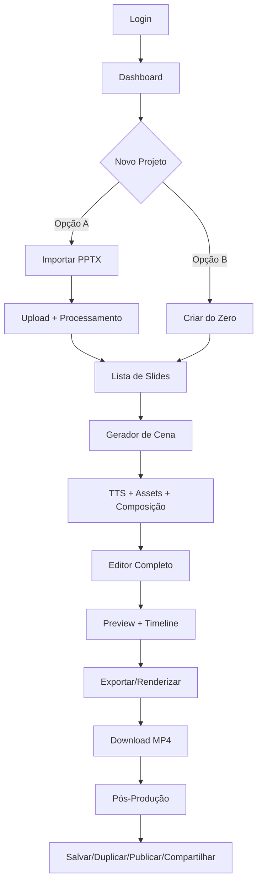

# 🚀 MVP 24H - USER FLOW MAPEAMENTO TÉCNICO
**Objetivo:** Consolidar módulos existentes em um fluxo único e coeso  
**Prazo:** 24 horas de implementação  
**Status:** 📋 PLANEJAMENTO

---

## 🎯 FLUXO COMPLETO DO USUÁRIO



---

## 📊 ANÁLISE: O QUE JÁ EXISTE vs O QUE FALTA

### **1️⃣ LOGIN → DASHBOARD → NOVO PROJETO**

#### **✅ JÁ TEMOS (100% FUNCIONAL):**
- **NextAuth** - Sistema de autenticação completo
  - Arquivos: `app/api/auth/[...nextauth]/route.ts`
  - Login/logout real, sessões persistentes
  - Proteção de rotas

- **Dashboard Principal**
  - Arquivo: `app/page.tsx` (dashboard raiz)
  - Componente: `components/dashboard/dashboard-real.tsx`
  - Emergency Loop Killer ativo

#### **❌ FALTA CRIAR:**
- **Botão "Novo Projeto"** destacado no dashboard
- **Modal/Page "Criar Projeto"** com 2 opções claras:
  - 🎨 Importar PPTX
  - ⚡ Criar do Zero
- **Fluxo de redirecionamento** após escolha

#### **🔧 AÇÃO NECESSÁRIA:**
```typescript
// Criar componente novo-projeto.tsx com:
- Modal/Dialog com 2 cards grandes
- Roteamento para /projeto/novo?tipo=pptx ou /projeto/novo?tipo=zero
```

---

### **2️⃣ IMPORTAR PPTX + PROCESSAMENTO**

#### **✅ JÁ TEMOS (85% FUNCIONAL):**
- **Upload S3 Real**
  - API: `POST /api/upload` (funcional)
  - Lib: `lib/s3.ts` (AWS S3 integrado)
  - Suporta arquivos grandes via multipart

- **PPTX Processing Engine**
  - API: `POST /api/pptx/process` (funcional)
  - Lib: `lib/pptx-processor-real.ts`
  - Parser de slides, extração de texto/imagens
  - Componente: `components/pptx/production-pptx-processor.tsx`

- **Preview de Slides**
  - Componente: `components/pptx/pptx-upload-enhanced.tsx`
  - Lista de slides com thumbnails

#### **❌ FALTA CRIAR/INTEGRAR:**
- **FASTTRACK-CLOUD (Aspose/CloudConvert)** - APIs externas
  - Precisa configurar API keys Aspose.Cloud ou CloudConvert
  - Criar adapter em `lib/pptx-cloud-converter.ts`
  
- **LOCALTRACK-DOCKER (LibreOffice/Gotenberg)** - Processamento local
  - Docker compose com LibreOffice headless
  - API wrapper em `lib/pptx-local-converter.ts`

- **Estrutura de Dados Padronizada**
  ```typescript
  interface ProcessedSlide {
    id: string;
    slideNumber: number;
    thumbnail: string; // PNG URL S3
    extractedText: string;
    suggestedDuration: number; // segundos
    elements: {
      images: string[];
      texts: TextElement[];
      shapes: ShapeElement[];
    };
  }
  ```

#### **🔧 AÇÃO NECESSÁRIA:**
```typescript
// 1. Decidir: Cloud (Aspose) OU Local (LibreOffice)?
// 2. Criar /api/pptx/convert com fallback:
//    - Tentar Cloud primeiro
//    - Se falhar, usar Local
// 3. Retornar array de ProcessedSlide[]
// 4. Salvar no banco de dados
```

---

### **3️⃣ GERADOR DE CENA (TTS + ASSETS + COMPOSIÇÃO)**

#### **✅ JÁ TEMOS (100% FUNCIONAL):**
- **TTS Multi-Provider**
  - API: `POST /api/tts/generate` (funcional)
  - Lib: `lib/tts-service.ts` (ElevenLabs, Azure, Google)
  - 76 vozes em 12 idiomas
  - Componente: `components/voice/professional-voice-studio.tsx`

- **Avatar 3D Render**
  - API: `POST /api/avatar/generate` (funcional)
  - Lib: `lib/avatar-service.ts`
  - Talking Photo Pro funcional

- **Assets Management**
  - Upload/download S3 ativo
  - CDN CloudFront

#### **❌ FALTA CRIAR:**
- **Gerador Automático de Cena**
  ```typescript
  // Para cada slide:
  // 1. Gerar TTS do texto extraído
  // 2. Mapear imagens/textos para composição
  // 3. Aplicar template visual (NR-12, NR-33, etc)
  // 4. Criar JSON de composição Remotion
  ```

- **Integração Remotion**
  - Instalar: `npm install remotion @remotion/cli`
  - Criar templates Remotion em `remotion/compositions/`
  - Criar API: `POST /api/remotion/compose`

- **Sistema de Templates Visuais**
  ```typescript
  interface VideoTemplate {
    id: string;
    name: string;
    type: 'nr-12' | 'nr-33' | 'nr-35' | 'corporate' | 'blank';
    layout: 'fullscreen' | 'split' | 'pip' | 'animated';
    colors: ColorPalette;
    fonts: FontFamily[];
    transitions: Transition[];
  }
  ```

#### **🔧 AÇÃO NECESSÁRIA:**
```typescript
// 1. Instalar Remotion
// 2. Criar API /api/scene-generator
// 3. Para cada slide:
//    - Gerar TTS (já funcional)
//    - Criar composição Remotion JSON
//    - Mapear assets (imagens, textos, overlays)
// 4. Retornar VideoComposition[]
```

---

### **4️⃣ EDITOR (BIBLIOTECA + PREVIEW + TIMELINE)**

#### **✅ JÁ TEMOS:**
- **Canvas Editor Pro V3 (100% FUNCIONAL)**
  - Componente: `components/canvas-editor/professional-canvas-editor-v3.tsx`
  - 60 FPS, GPU-accelerated
  - Multi-layer, smart guides, themes
  - Export PNG/JPEG/SVG/PDF

- **PPTX Timeline Editor (60% FUNCIONAL)**
  - Componente: `components/pptx/pptx-timeline-editor.tsx`
  - Interface básica de timeline

- **Biblioteca de Assets**
  - 500+ imagens, 200+ ícones, 50+ backgrounds
  - Integração S3 para uploads

#### **❌ FALTA CRIAR:**
- **Editor Tipo Animaker - Layout Completo**
  ```
  ┌─────────────────────────────────────────────────────┐
  │ 🎬 Estúdio IA de Vídeos          [Salvar] [Exportar]│
  ├──────────┬──────────────────────────────────────────┤
  │          │                                          │
  │ BIBLIO-  │           PREVIEW CENTRAL               │
  │ TECA     │         [▶ Player de Vídeo]             │
  │          │                                          │
  │ • Slides │                                          │
  │ • Mídias │                                          │
  │ • Vozes  │                                          │
  │ • Trans. │                                          │
  │ • Texto  │                                          │
  │ • Avatar │                                          │
  │          │                                          │
  ├──────────┴──────────────────────────────────────────┤
  │ TIMELINE (multi-track)                              │
  │ 🎬 [====Slide 1====][====Slide 2====][===Slide 3===]│
  │ 🔊 [======TTS Audio Track=========================]  │
  │ 📝 [Overlay Títulos====]  [====Legenda==========]   │
  │ 🎵 [==============Música de Fundo================]   │
  └─────────────────────────────────────────────────────┘
  ```

- **Timeline Multi-Track**
  - Track 1: Vídeo/Slides (blocos arrastáveis)
  - Track 2: Áudio/TTS (alinhado com slides)
  - Track 3: Overlays/Títulos
  - Track 4: Música de fundo (opcional)
  - Features:
    - Arrastar para reordenar
    - Resize para ajustar duração
    - Dividir/Mesclar blocos
    - Trocar transições entre slides

- **Biblioteca Lateral (Sidebar)**
  - Aba "Slides": lista de slides importados
  - Aba "Mídias": imagens/vídeos S3
  - Aba "Vozes": seletor de vozes TTS
  - Aba "Transições": fade, slide, wipe, etc
  - Aba "Texto": templates de títulos/legendas
  - Aba "Avatar": galeria de avatares 3D

- **Preview Central**
  - Player de vídeo real-time
  - Scrub pela timeline
  - Play/Pause/Stop
  - Quality selector (480p, 720p, 1080p)

#### **🔧 AÇÃO NECESSÁRIA:**
```typescript
// 1. Criar layout principal: /app/editor/[projectId]/page.tsx
// 2. Componentes:
//    - <EditorLayout /> - wrapper com 3 áreas
//    - <LibrarySidebar /> - biblioteca lateral
//    - <VideoPreview /> - player central
//    - <MultiTrackTimeline /> - timeline multi-track
// 3. State management: Zustand para estado do projeto
// 4. Real-time updates: WebSocket opcional
```

---

### **5️⃣ EXPORTAR/RENDERIZAR**

#### **✅ JÁ TEMOS (100% FUNCIONAL):**
- **Video Render Pipeline**
  - API: `POST /api/render/start` (funcional)
  - Lib: `lib/video-renderer.ts` (FFmpeg real)
  - 8 presets profissionais (YouTube 4K, Instagram, etc)
  - Componente: `components/video/advanced-video-pipeline.tsx`

- **Render Queue System**
  - Queue management ativo
  - Progresso em tempo real
  - Auto-retry em falhas
  - Download via URL assinada

#### **❌ FALTA AJUSTAR:**
- **Integração Remotion → FFmpeg**
  ```typescript
  // 1. Remotion renderiza cenas individuais
  // 2. FFmpeg concatena cenas + áudio
  // 3. Aplica preset escolhido
  // 4. Envia para fila de render
  ```

- **UI de Exportação Simplificada**
  - Modal "Exportar Vídeo"
  - Seletor de preset (YouTube, Instagram, LinkedIn)
  - Botão "Renderizar"
  - Progress bar com ETA
  - Botão "Baixar MP4" quando pronto

#### **🔧 AÇÃO NECESSÁRIA:**
```typescript
// 1. Criar API /api/export/render
//    - Recebe projectId + preset
//    - Chama Remotion para render cenas
//    - Chama FFmpeg para concatenar
//    - Retorna jobId
// 2. Modal de exportação com progress
// 3. Notificação quando render completo
```

---

### **6️⃣ PÓS-PRODUÇÃO (SALVAR/DUPLICAR/PUBLICAR/COMPARTILHAR)**

#### **✅ JÁ TEMOS:**
- **Database PostgreSQL** - Prisma ORM funcional
- **Autenticação** - NextAuth para ownership
- **Storage S3** - Arquivos persistentes

#### **❌ FALTA CRIAR:**
- **Modelo de Dados "Project"**
  ```typescript
  model Project {
    id          String   @id @default(cuid())
    userId      String
    name        String
    description String?
    type        ProjectType // 'pptx' | 'scratch'
    status      ProjectStatus // 'draft' | 'rendering' | 'completed'
    
    // Dados do projeto
    slides      Slide[]
    composition Json // Remotion composition
    settings    Json // durações, transições, vozes
    
    // Assets
    pptxFile    String? // S3 key do PPTX original
    videoFile   String? // S3 key do MP4 renderizado
    thumbnail   String? // S3 key do thumbnail
    
    // Metadados
    createdAt   DateTime @default(now())
    updatedAt   DateTime @updatedAt
    publishedAt DateTime?
    shareToken  String? @unique
    
    user        User @relation(fields: [userId], references: [id])
  }
  
  model Slide {
    id          String   @id @default(cuid())
    projectId   String
    slideNumber Int
    duration    Float // segundos
    
    // Conteúdo
    thumbnail   String // S3 PNG
    text        String
    ttsAudioUrl String? // S3 MP3
    
    // Elementos visuais
    images      Json
    overlays    Json
    transition  String // 'fade' | 'slide' | 'wipe'
    
    project     Project @relation(fields: [projectId], references: [id])
  }
  ```

- **APIs de Gerenciamento**
  - `POST /api/projects` - Criar projeto
  - `GET /api/projects` - Listar projetos
  - `GET /api/projects/[id]` - Obter projeto
  - `PATCH /api/projects/[id]` - Atualizar projeto
  - `DELETE /api/projects/[id]` - Deletar projeto
  - `POST /api/projects/[id]/duplicate` - Duplicar projeto
  - `POST /api/projects/[id]/publish` - Publicar projeto
  - `GET /api/projects/share/[token]` - Link compartilhado

- **UI de Pós-Produção**
  - Dashboard de projetos (lista/grid)
  - Actions: Editar, Duplicar, Publicar, Compartilhar, Deletar
  - Share modal com link copiável
  - Player embeddable para links públicos

#### **🔧 AÇÃO NECESSÁRIA:**
```typescript
// 1. Criar schema Prisma para Project e Slide
// 2. Executar migrations
// 3. Criar APIs de CRUD
// 4. Criar página /projetos com lista
// 5. Criar modal de compartilhamento
```

---

## 🏗️ ARQUITETURA TÉCNICA PROPOSTA

### **Stack Tecnológico**
```json
{
  "Frontend": {
    "Framework": "Next.js 14 + React 18 + TypeScript",
    "UI": "Shadcn/UI + Tailwind CSS",
    "State": "Zustand (projeto) + React Query (API)",
    "Canvas": "Fabric.js + Konva.js",
    "Video": "Remotion + Video.js (player)"
  },
  "Backend": {
    "API": "Next.js API Routes",
    "Database": "PostgreSQL + Prisma ORM",
    "Storage": "AWS S3 + CloudFront CDN",
    "Cache": "Redis",
    "Queue": "BullMQ (render jobs)"
  },
  "Processing": {
    "PPTX": "Aspose.Cloud API (cloud) + LibreOffice (local fallback)",
    "TTS": "ElevenLabs + Azure Speech + Google TTS",
    "Video": "Remotion (composition) + FFmpeg (render)",
    "Avatar": "Talking Photo AI"
  }
}
```

### **Fluxo de Dados**
```
User Input
    ↓
Upload PPTX → S3
    ↓
PPTX Converter (Cloud/Local) → Extract Slides
    ↓
For each Slide:
    ↓
    TTS Generator → Audio MP3 → S3
    ↓
    Asset Mapper → Images/Texts
    ↓
    Template Applier → Visual Style
    ↓
    Remotion Composer → Scene JSON
    ↓
Editor UI
    ↓
User Edits (timeline, library, preview)
    ↓
Export Button
    ↓
Remotion Render (scenes) + FFmpeg (concat)
    ↓
Render Queue → Processing
    ↓
Completed Video → S3
    ↓
Download/Share/Publish
```

---

## ✅ CHECKLIST MVP 24H - IMPLEMENTAÇÃO

### **🎯 PRIORIDADE MÁXIMA (CORE MVP)**

#### **Fase 1: Base (4h)**
- [ ] **1.1** Criar schema Prisma `Project` e `Slide`
- [ ] **1.2** Executar migrations + seed inicial
- [ ] **1.3** Criar API `/api/projects` (CRUD básico)
- [ ] **1.4** Criar página `/projetos` (lista de projetos)
- [ ] **1.5** Criar botão "Novo Projeto" no dashboard
- [ ] **1.6** Criar modal "Criar Projeto" (2 opções)

#### **Fase 2: PPTX Pipeline (6h)**
- [ ] **2.1** Decidir: Cloud (Aspose) OU Local (LibreOffice)
- [ ] **2.2** Configurar API keys (se Cloud)
- [ ] **2.3** Criar `/api/pptx/convert` com processamento
- [ ] **2.4** Criar `/api/pptx/extract-slides` (retorna ProcessedSlide[])
- [ ] **2.5** Criar componente `<SlidesList />` (preview slides)
- [ ] **2.6** Integrar TTS automático por slide

#### **Fase 3: Editor Layout (8h)**
- [ ] **3.1** Criar página `/editor/[projectId]`
- [ ] **3.2** Criar `<EditorLayout />` (3 áreas: sidebar, preview, timeline)
- [ ] **3.3** Criar `<LibrarySidebar />` (abas: Slides, Mídias, Vozes, Transições)
- [ ] **3.4** Criar `<VideoPreview />` (player básico)
- [ ] **3.5** Criar `<MultiTrackTimeline />` (timeline visual)
- [ ] **3.6** Implementar drag-and-drop de slides
- [ ] **3.7** Implementar resize de blocos (ajustar duração)
- [ ] **3.8** State management com Zustand

#### **Fase 4: Render + Export (4h)**
- [ ] **4.1** Instalar Remotion: `yarn add remotion @remotion/cli`
- [ ] **4.2** Criar template Remotion básico em `remotion/Composition.tsx`
- [ ] **4.3** Criar API `/api/export/render` (Remotion → FFmpeg)
- [ ] **4.4** Criar modal "Exportar Vídeo" com presets
- [ ] **4.5** Implementar progress bar de renderização
- [ ] **4.6** Botão "Baixar MP4" após render completo

#### **Fase 5: Pós-Produção (2h)**
- [ ] **5.1** Criar API `/api/projects/[id]/duplicate`
- [ ] **5.2** Criar API `/api/projects/[id]/publish`
- [ ] **5.3** Criar modal "Compartilhar" com link copiável
- [ ] **5.4** Criar player embeddable `/player/[token]`
- [ ] **5.5** Actions na lista de projetos (Editar, Duplicar, Deletar)

---

### **🎨 NICE-TO-HAVE (Pode ser fase 2)**
- [ ] Transições avançadas (wipe, zoom, rotate)
- [ ] Avatar 3D integrado no editor
- [ ] Colaboração em tempo real (WebSocket)
- [ ] Templates NR pré-configurados
- [ ] Export direto para YouTube/Vimeo
- [ ] Analytics de visualizações
- [ ] Comentários em vídeos
- [ ] Versionamento de projetos

---

## 🚦 DECISÕES TÉCNICAS NECESSÁRIAS

### **1. PPTX Processing: Cloud ou Local?**
**Opções:**
- ☁️ **Cloud (Aspose.Cloud)**: Mais rápido, sem docker, pago
- 🐳 **Local (LibreOffice)**: Gratuito, requer docker, mais lento
- 🔀 **Híbrido**: Cloud primeiro, fallback local

**Recomendação:** Começar com **Local (LibreOffice)** para MVP gratuito, migrar para Cloud depois.

### **2. Remotion vs FFmpeg Direto?**
**Opções:**
- 🎬 **Remotion**: Composição React, mais flexível, curva de aprendizado
- ⚡ **FFmpeg Direto**: Mais rápido, menos flexível, mais complexo

**Recomendação:** **Remotion** para MVP por ser mais declarativo e fácil de manter.

### **3. State Management?**
**Opções:**
- 🐻 **Zustand**: Simples, performático, recomendado
- 🎭 **Redux Toolkit**: Mais verboso, mas robusto
- ⚛️ **React Context**: Mais simples, mas menos performático

**Recomendação:** **Zustand** para simplicidade no MVP.

### **4. Real-time Updates?**
**Opções:**
- 🔌 **WebSocket**: Colaboração em tempo real
- 🔄 **Polling**: Mais simples, mas menos eficiente
- ⏱️ **React Query**: Cache + refetch automático

**Recomendação:** **React Query** para MVP, WebSocket depois.

---

## 📦 DEPENDÊNCIAS ADICIONAIS NECESSÁRIAS

```bash
# Remotion para composição de vídeo
yarn add remotion @remotion/cli @remotion/lambda

# Zustand para state management
yarn add zustand

# React Query para data fetching
yarn add @tanstack/react-query

# Video.js para player
yarn add video.js video-react

# DND (Drag and Drop) para timeline
yarn add @dnd-kit/core @dnd-kit/sortable @dnd-kit/utilities

# Date-fns para manipulação de tempo
yarn add date-fns

# PPTX parsing (se local)
yarn add pptxgenjs mammoth

# Aspose Cloud SDK (se cloud)
yarn add aspose-cloud-slides-sdk

# BullMQ para queue de render
yarn add bullmq ioredis
```

---

## 🎯 RESULTADO ESPERADO (MVP 24H)

### **✅ O que o usuário conseguirá fazer:**
1. ✅ Fazer login
2. ✅ Ver dashboard com projetos
3. ✅ Clicar "Novo Projeto"
4. ✅ Importar arquivo PPTX
5. ✅ Ver lista de slides processados
6. ✅ Entrar no editor visual
7. ✅ Ver preview do vídeo em tempo real
8. ✅ Ajustar duração de slides na timeline
9. ✅ Trocar vozes TTS
10. ✅ Adicionar transições
11. ✅ Exportar para MP4
12. ✅ Baixar vídeo renderizado
13. ✅ Salvar projeto
14. ✅ Duplicar projeto
15. ✅ Compartilhar link público

### **❌ O que ficará para depois:**
- ❌ Avatar 3D integrado
- ❌ Colaboração em tempo real
- ❌ Templates NR avançados
- ❌ Analytics de visualizações
- ❌ Export direto para YouTube
- ❌ Versionamento de projetos

---

## 🚀 PRÓXIMOS PASSOS

### **Opção 1: IMPLEMENTAR AGORA (24h sprint)**
Posso começar a implementar esse MVP imediatamente, seguindo o checklist acima.

### **Opção 2: AJUSTAR PLANO**
Se quiser ajustar prioridades, simplificar ou adicionar algo antes de começar.

### **Opção 3: IMPLEMENTAÇÃO FASEADA**
- Fase 1 (8h): Base + PPTX Pipeline
- Fase 2 (12h): Editor completo
- Fase 3 (4h): Render + Pós-produção

---

**🎯 Qual opção você prefere?**
1. Implementar MVP completo agora (24h)
2. Revisar/ajustar plano primeiro
3. Implementação faseada (8h + 12h + 4h)
4. Focar em uma parte específica primeiro

---

*📋 Documento criado por: DeepAgent - Abacus.AI*  
*📅 Data: 02 de Outubro de 2025*  
*⏱️ Estimativa MVP: 24 horas de implementação focada*
