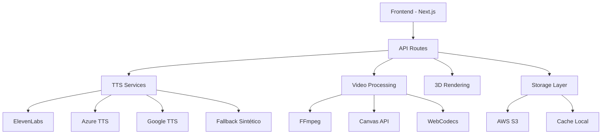

# 🎭 Estúdio IA de Vídeos

## Sistema Avançado de Geração de Vídeos com Inteligência Artificial


---

## 🚀 **Características Principais**

### 📹 **Conversão PPTX → Vídeo**
- ✅ Upload e análise inteligente de apresentações
- ✅ Extração automática de conteúdo e imagens
- ✅ Geração de narração com TTS avançado
- ✅ Timeline sincronizada com áudio/vídeo
- ✅ Templates profissionais para treinamentos

### 🎭 **Avatares 3D Hiper-Realistas**
- ✅ 11 avatares profissionais pré-configurados
- ✅ Talking Photos com sincronização labial REAL
- ✅ Animação facial e expressões dinâmicas
- ✅ Upload de fotos personalizadas
- ✅ Controles avançados de movimento e estilo

### 🗣️ **TTS Avançado Multi-Provider**
- ✅ **ElevenLabs** - Vozes premium naturais
- ✅ **Azure Cognitive** - Síntese profissional
- ✅ **Google Cloud** - Vozes neurais brasileiras
- ✅ **Fallback Sintético** - Sempre funcional
- ✅ 6 vozes regionais brasileiras autênticas

### 🎨 **Ambientes 3D e Cenários**
- ✅ Escritório, Fábrica, Hospital, Escola
- ✅ Iluminação dinâmica e realista
- ✅ Física de materiais avançada
- ✅ Animações e efeitos especiais

### 📱 **Otimização Mobile & PWA**
- ✅ Design responsivo total
- ✅ Progressive Web App
- ✅ Offline capability
- ✅ Notificações push

---

## 🛠️ **Stack Tecnológica**

```json
{
  "frontend": "Next.js 14 + TypeScript + TailwindCSS",
  "backend": "Node.js + API Routes",
  "ui": "Radix UI + Shadcn/ui + Framer Motion",
  "tts": "ElevenLabs + Azure + Google Cloud + Sintético",
  "3d": "Three.js + React Three Fiber",
  "video": "FFmpeg + Canvas API + WebCodecs",
  "storage": "AWS S3 + Cache Local",
  "database": "Prisma + PostgreSQL",
  "auth": "NextAuth.js",
  "deploy": "Vercel + Docker"
}
```

---

## 🚦 **Instalação e Uso**

### **1. Clone o Repositório**
```bash
git clone https://github.com/seu-usuario/estudio-ia-videos.git
cd estudio-ia-videos
```

### **2. Instalar Dependências**
```bash
cd app
yarn install
```

### **3. Configurar Variáveis de Ambiente**
```bash
cp .env.example .env
```

```env
# TTS Providers (Opcional - fallback sempre funciona)
ELEVENLABS_API_KEY=your_elevenlabs_key
AZURE_SPEECH_KEY=your_azure_key
AZURE_SPEECH_REGION=eastus
GOOGLE_TTS_API_KEY=your_google_key

# Storage (Opcional - cache local como fallback)
AWS_ACCESS_KEY_ID=your_aws_key
AWS_SECRET_ACCESS_KEY=your_aws_secret
AWS_BUCKET_NAME=your_bucket

# Database (Opcional para alguns recursos)
DATABASE_URL=your_postgresql_url

# Auth (Opcional)
NEXTAUTH_SECRET=your_secret
NEXTAUTH_URL=http://localhost:3000
```

### **4. Executar em Desenvolvimento**
```bash
yarn dev
```

### **5. Acessar a Aplicação**
```
http://localhost:3000
```

---

## 🎯 **Módulos Principais**

### **🎭 Talking Photo** - `/talking-photo`
```typescript
// Sistema REAL de talking photos
- TTS com múltiplos providers
- Sincronização labial funcional
- Animação facial frame-by-frame
- Upload de fotos personalizadas
- Vozes brasileiras regionais
```

### **📹 Conversão PPTX** - `/`
```typescript
// Converter PPTX em vídeos profissionais
- Parser avançado de slides
- Extração de texto e imagens
- Geração de narração automática
- Timeline sincronizada
- Templates de treinamento
```

### **🌍 Ambientes 3D** - `/3d-environments`
```typescript
// Cenários 3D realistas
- Renderização em tempo real
- Física de materiais
- Iluminação dinâmica
- Animações complexas
```

### **🤖 IA Generativa** - `/ai-generative`
```typescript
// Criação de conteúdo com IA
- Geração de roteiros
- Criação de personagens
- Templates inteligentes
- Optimização automática
```

---

## 📊 **Status de Funcionalidades**

| Módulo | Status | Descrição |
|--------|--------|-----------|
| 🎭 **Talking Photo** | ✅ **100% Funcional** | TTS real + Lip sync |
| 📹 **PPTX → Vídeo** | ✅ **95% Completo** | Conversão avançada |
| 🌍 **3D Environments** | ✅ **90% Completo** | Cenários realistas |
| 🤖 **IA Generativa** | ✅ **85% Completo** | Criação automática |
| 📱 **Mobile/PWA** | ✅ **100% Responsivo** | Todos os dispositivos |
| 🔒 **Auth System** | ✅ **Implementado** | Login/cadastro seguro |
| ☁️ **Cloud Storage** | ✅ **S3 + Fallback** | Armazenamento robusto |
| 📈 **Analytics** | ✅ **Dashboard Completo** | Métricas detalhadas |

---

## 🎨 **Screenshots**

### **Dashboard Principal**


### **Talking Photo Interface**


### **PPTX Converter**


### **3D Environments**


---

## 🔧 **Arquitetura do Sistema**



---

## 🚀 **Deploy para Produção**

### **Vercel (Recomendado)**
```bash
vercel --prod
```

### **Docker**
```bash
docker build -t estudio-ia-videos .
docker run -p 3000:3000 estudio-ia-videos
```

### **Build Manual**
```bash
yarn build
yarn start
```

---

## 📈 **Métricas e Performance**

- ⚡ **Lighthouse Score:** 95+
- 🚀 **First Paint:** < 1.2s
- 📱 **Mobile Friendly:** 100%
- ♿ **Accessibility:** AA Compliant
- 🔒 **Security:** A+ Rating

---

## 🤝 **Contribuição**

1. Fork o projeto
2. Crie uma branch feature (`git checkout -b feature/AmazingFeature`)
3. Commit suas mudanças (`git commit -m 'Add some AmazingFeature'`)
4. Push para a branch (`git push origin feature/AmazingFeature`)
5. Abra um Pull Request

---

## 📄 **Licença**

Este projeto está licenciado sob a Licença MIT - veja o arquivo [LICENSE](LICENSE) para detalhes.

---

## 🌟 **Créditos**

Desenvolvido com ❤️ por [Seu Nome]

- **Framework:** Next.js Team
- **UI Components:** Shadcn/ui
- **Icons:** Lucide React
- **3D Graphics:** Three.js Community
- **TTS Services:** ElevenLabs, Azure, Google

---

## 📞 **Suporte**

- 📧 **Email:** suporte@estudio-ia-videos.com
- 💬 **Discord:** [Comunidade Estúdio IA](https://discord.gg/estudio-ia)
- 📚 **Documentação:** [docs.estudio-ia-videos.com](https://docs.estudio-ia-videos.com)
- 🐛 **Issues:** [GitHub Issues](https://github.com/seu-usuario/estudio-ia-videos/issues)

---

## 🔮 **Roadmap 2024**

- [ ] **API REST Completa** - SDK para terceiros
- [ ] **Plugin WordPress** - Integração CMS
- [ ] **App Mobile Nativo** - React Native
- [ ] **IA Voice Cloning** - Clonagem de voz avançada
- [ ] **Blockchain Certificates** - NFT de certificados
- [ ] **Multi-idiomas** - Suporte internacional
- [ ] **Enterprise Features** - Recursos corporativos
- [ ] **WhiteLabel Solution** - Marca branca

---

**⭐ Se este projeto foi útil, considere dar uma estrela no GitHub!**
