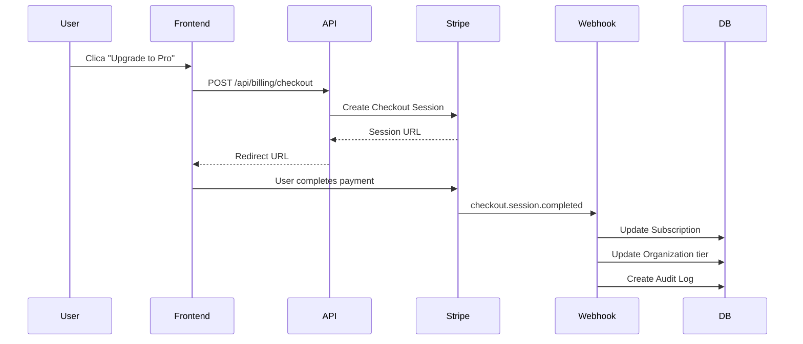

# Arquitetura Multi-Tenancy

## 🏗️ Visão Geral

O sistema utiliza uma arquitetura de **multi-tenancy com isolamento lógico** (não físico). Todas as organizações compartilham o mesmo database, mas os dados são isolados através de:

1. **Scoping de queries** - Todas as queries incluem `organizationId`
2. **Middleware** - Injeta contexto da org em todas as requests
3. **Permission checks** - Valida role antes de qualquer operação
4. **Audit logging** - Registra todas as ações para compliance

## 🔐 Modelo de Segurança

### Camadas de Proteção

```
┌─────────────────────────────────────────┐
│           1. API Route Layer            │
│    - Validação de sessão (NextAuth)     │
│    - Extract orgId do request           │
└─────────────────────────────────────────┘
                    ↓
┌─────────────────────────────────────────┐
│      2. Permission Check Layer          │
│    - getOrgContext(userId, orgId)       │
│    - hasPermission(role, permission)    │
└─────────────────────────────────────────┘
                    ↓
┌─────────────────────────────────────────┐
│         3. Data Access Layer            │
│    - scopeToOrg(orgId, where)           │
│    - Prisma queries com organizationId  │
└─────────────────────────────────────────┘
                    ↓
┌─────────────────────────────────────────┐
│          4. Audit Log Layer             │
│    - createAuditLog() para todas ações  │
└─────────────────────────────────────────┘
```

### Exemplo de Proteção

```typescript
// ❌ ERRADO - Sem scoping
const projects = await prisma.project.findMany();

// ✅ CORRETO - Com scoping
const orgContext = await getOrgContext(userId, orgId);
if (!orgContext) throw new Error('Access denied');

const projects = await prisma.project.findMany({
  where: {
    organizationId: orgId,
  },
});
```

## 🔄 Fluxo de Request

### 1. User faz request
```
POST /api/org/abc123/members
Headers: Cookie: next-auth.session-token=...
Body: { email: "user@example.com", role: "MEMBER" }
```

### 2. Middleware processa
```typescript
// next.config.js + middleware
const token = await getToken({ req });
const orgId = request.headers.get('x-organization-id') || 
              request.cookies.get('org-id')?.value;

// Injeta no header
requestHeaders.set('x-organization-id', orgId);
requestHeaders.set('x-user-id', token.sub);
```

### 3. API Route valida
```typescript
// app/api/org/[orgId]/members/route.ts
export async function POST(request: NextRequest, { params }: { params: { orgId: string } }) {
  const session = await getServerSession();
  if (!session?.user?.email) {
    return NextResponse.json({ error: 'Unauthorized' }, { status: 401 });
  }
  
  const user = await prisma.user.findUnique({ 
    where: { email: session.user.email } 
  });
  
  const orgContext = await getOrgContext(user.id, params.orgId);
  if (!orgContext || !hasPermission(orgContext.role, 'members:manage')) {
    return NextResponse.json({ error: 'Access denied' }, { status: 403 });
  }
  
  // Validar limites
  const limits = await validateOrgLimits(params.orgId);
  if (!limits.canAddMember) {
    return NextResponse.json({ error: 'Member limit reached' }, { status: 403 });
  }
  
  // Processar...
}
```

### 4. Database query
```typescript
const member = await prisma.organizationMember.create({
  data: {
    organizationId: params.orgId, // Sempre inclui orgId
    userId: invitedUser.id,
    role,
    status: 'INVITED',
    invitedBy: user.id,
  },
});
```

### 5. Audit log
```typescript
await createAuditLog({
  organizationId: params.orgId,
  userId: user.id,
  action: 'member:invited',
  resource: 'member',
  resourceId: member.id,
  metadata: { email, role },
});
```

## 💾 Database Design

### Estratégia de Indexação

Todos os models multi-tenant têm índices em `organizationId`:

```prisma
model Project {
  id             String  @id @default(cuid())
  organizationId String
  
  @@index([organizationId])
  @@index([userId, status])
}
```

Isso garante performance nas queries filtradas por org.

### Integridade Referencial

```prisma
model Project {
  organizationId String
  organization   Organization @relation(fields: [organizationId], references: [id], onDelete: Cascade)
}
```

`onDelete: Cascade` garante que quando uma org é deletada, todos os dados relacionados também são.

## 🔌 Stripe Integration

### Fluxo de Pagamento



### Webhook Security

```typescript
// Verify signature
const event = stripe.webhooks.constructEvent(
  body,
  signature,
  STRIPE_WEBHOOK_SECRET
);

// This ensures the webhook really came from Stripe
```

### Metadata Tracking

Todos os objetos Stripe incluem `organizationId` no metadata:

```typescript
const session = await stripe.checkout.sessions.create({
  metadata: {
    organizationId: 'org_abc123',
  },
  subscription_data: {
    metadata: {
      organizationId: 'org_abc123',
    },
  },
});
```

Isso permite identificar a org nos webhooks.

## 🎨 White-Label Implementation

### Dynamic Theming

```typescript
// 1. Load settings per org
const settings = await prisma.whiteLabelSettings.findUnique({
  where: { organizationId: orgId },
});

// 2. Apply to root layout
<html style={{
  '--primary-color': settings.primaryColor,
  '--secondary-color': settings.secondaryColor,
  '--bg-color': settings.backgroundColor,
}}>

// 3. Components use CSS variables
.button {
  background-color: var(--primary-color);
}
```

### Custom Domain Routing

```typescript
// middleware.ts
function extractOrgFromSubdomain(url: string): string | null {
  const hostname = new URL(url).hostname;
  
  // acme.estudioai.com.br → look up org with domain='acme.estudioai.com.br'
  const org = await prisma.organization.findUnique({
    where: { domain: hostname },
  });
  
  return org?.id || null;
}
```

### DNS Configuration

Para domínio customizado funcionar:

1. Cliente configura CNAME: `videos.empresa.com.br` → `estudioai.com.br`
2. Sistema verifica DNS periodicamente
3. Quando verificado, `domainVerified = true`
4. Requests para `videos.empresa.com.br` são roteados para a org correta

## 🧪 Testing Strategy

### Unit Tests
- Permission checks
- Limit validation
- Scoping helpers

### Integration Tests
- API routes com diferentes roles
- Webhook handlers
- Billing flows

### E2E Tests (Playwright)
- Multi-org creation
- Member invitation
- Upgrade flow
- White-label customization

### Security Tests
- Data leakage between orgs
- Permission bypass attempts
- SQL injection via orgId
- CSRF on sensitive endpoints

## 📈 Performance Considerations

### Query Optimization

```typescript
// ❌ N+1 problem
for (const project of projects) {
  const owner = await prisma.user.findUnique({ where: { id: project.userId } });
}

// ✅ Use includes/select
const projects = await prisma.project.findMany({
  where: { organizationId: orgId },
  include: { user: true },
});
```

### Caching Strategy

```typescript
// Cache org context per request
const orgContextCache = new Map<string, OrgContext>();

export async function getOrgContext(userId: string, orgId: string) {
  const cacheKey = `${userId}:${orgId}`;
  
  if (orgContextCache.has(cacheKey)) {
    return orgContextCache.get(cacheKey);
  }
  
  const context = await fetchFromDB();
  orgContextCache.set(cacheKey, context);
  return context;
}
```

### Database Connection Pooling

```typescript
// lib/db.ts
const prisma = new PrismaClient({
  datasources: {
    db: {
      url: process.env.DATABASE_URL,
    },
  },
  // Connection pooling
  pool: {
    max: 10,
    min: 2,
  },
});
```

## 🔮 Future Enhancements

### Physical Isolation for Enterprise
Para clientes Enterprise muito grandes, considerar:
- Database dedicado por org
- Separate Redis instance
- Dedicated worker nodes

### Sharding Strategy
Para escalar além de milhões de orgs:
- Shard por `organizationId` hash
- Shard 0: org_a..org_f
- Shard 1: org_g..org_m
- Shard 2: org_n..org_z

### Read Replicas
Para analytics e reports:
- Write master: operational queries
- Read replica: analytics, exports

---

**Documentação**: Sprint 35 Architecture
**Versão**: 1.0
**Data**: 2025-10-02
