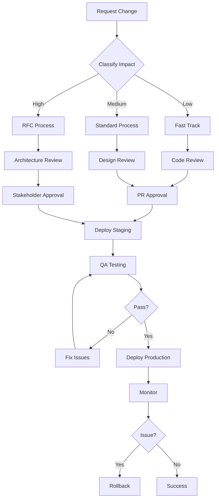

# Change Management Process

## 🎯 Objetivo
Estabelecer um processo estruturado para gerenciar mudanças no sistema, garantindo qualidade, segurança e continuidade operacional.

---

## 📋 Tipos de Mudanças

### 1. Mudanças Menores (Low Impact)
**Exemplos**: Bug fixes, ajustes de UI, atualizações de documentação

**Processo**:
1. Criar issue no GitHub
2. Desenvolver em branch `fix/nome-do-bug`
3. Pull Request com review de 1 pessoa
4. Merge após aprovação
5. Deploy automático para staging
6. Validação manual em staging
7. Deploy para produção (via merge para main)

**SLA**: 1-2 dias

### 2. Mudanças Médias (Medium Impact)
**Exemplos**: Novas features, refatorações, integrações

**Processo**:
1. Criar issue/proposal no GitHub
2. Review técnico do design
3. Desenvolver em branch `feature/nome-da-feature`
4. Pull Request com review de 2+ pessoas
5. QA testing em staging
6. Aprovação do PO/stakeholder
7. Deploy em horário de baixo tráfego

**SLA**: 1 semana

### 3. Mudanças Críticas (High Impact)
**Exemplos**: Mudanças de arquitetura, migrações de banco, mudanças de segurança

**Processo**:
1. Criar RFC (Request for Comments)
2. Review arquitetural com time técnico
3. Aprovação de stakeholders
4. Desenvolvimento com testes extensivos
5. QA completo + security review
6. Deploy em janela de manutenção programada
7. Monitoramento intensivo pós-deploy
8. Plano de rollback preparado

**SLA**: 2-4 semanas

---

## 🔄 Workflow de Change Management



---

## 📝 Change Request Template

### Issue Template: Feature/Change Request
```markdown
## Change Description
Brief description of the change

## Type
- [ ] Low Impact (Bug fix, UI tweak)
- [ ] Medium Impact (Feature, integration)
- [ ] High Impact (Architecture, migration)

## Motivation
Why is this change needed?

## Technical Approach
How will this be implemented?

## Risks
What are the potential risks?

## Rollback Plan
How can we revert this change if needed?

## Testing Plan
How will this be tested?

## Stakeholders
Who needs to approve this?

## Timeline
When does this need to be deployed?
```

---

## 🚨 Emergency Change Process

### When to Use
- Production outage
- Critical security vulnerability
- Data loss prevention

### Process
1. **Declare Emergency**: Notify team via Slack/alerts
2. **Fast Track Approval**: Get verbal approval from tech lead
3. **Implement Fix**: Direct commit to hotfix branch
4. **Deploy Immediately**: Skip staging, deploy to production
5. **Monitor Closely**: 24/7 monitoring for 48h
6. **Post-Mortem**: Document incident within 48h
7. **Retroactive PR**: Create PR for audit trail

---

## 📊 Change Tracking

### Metrics to Track
- Number of changes per week
- Success rate (% without rollback)
- Average time-to-deploy
- Number of emergency changes
- Downtime caused by changes

### Monthly Review
- Review all changes from past month
- Identify patterns (e.g., frequent bugs in module X)
- Update processes based on lessons learned

---

## ✅ Pre-Deployment Checklist

### For All Changes
- [ ] Code reviewed and approved
- [ ] Tests passing (unit + integration)
- [ ] Documentation updated
- [ ] Environment variables configured
- [ ] Rollback plan documented

### For Medium/High Impact Changes
- [ ] QA testing completed
- [ ] Performance impact assessed
- [ ] Security review completed
- [ ] Stakeholder approval obtained
- [ ] Monitoring alerts configured
- [ ] Communication plan ready (if user-facing)

---

## 🔙 Rollback Procedures

### Automated Rollback (Vercel)
```bash
# List recent deployments
vercel ls

# Rollback to previous deployment
vercel rollback <deployment-url>
```

### Manual Rollback (Self-Hosted)
```bash
# Stop application
pm2 stop mvp-video-app

# Checkout previous commit
git checkout <previous-commit-hash>

# Rebuild
npm run build

# Restart
pm2 restart mvp-video-app
```

### Database Rollback
```bash
# Revert migration
npx prisma migrate resolve --rolled-back <migration-name>

# Or restore from backup
psql < backup-<timestamp>.sql
```

---

## 📅 Maintenance Windows

### Scheduled Maintenance
- **Frequency**: 2nd Sunday of each month
- **Time**: 02:00-04:00 UTC (baixo tráfego)
- **Notification**: 1 week advance notice to users

### Unplanned Maintenance
- Minimize to critical-only
- Maximum 15 minutes downtime
- Immediate user notification

---

## 🎯 Success Criteria

### Change Management Process is Successful When:
- ✅ 95%+ of changes deployed without rollback
- ✅ < 2 emergency changes per month
- ✅ Average deployment time < 30 minutes
- ✅ Zero unplanned downtime from changes
- ✅ All changes properly documented

---

## 📈 Continuous Improvement

### Quarterly Review
1. Analyze change metrics
2. Identify bottlenecks in process
3. Update process documentation
4. Train team on improvements

### Feedback Loop
- Collect feedback from developers on process
- Adjust based on real-world usage
- Keep process lightweight and effective

---

## 🔐 Compliance & Audit

### Audit Trail
- All changes tracked in Git
- PR approvals recorded
- Deploy logs maintained for 1 year
- Rollbacks documented with reason

### Compliance Requirements
- SOC 2 Type II (future)
- GDPR compliance for data changes
- Security review for authentication changes

---

**Process Owner**: Tech Lead  
**Last Updated**: 2026-01-13  
**Next Review**: 2026-04-13  
**Status**: ✅ Active
