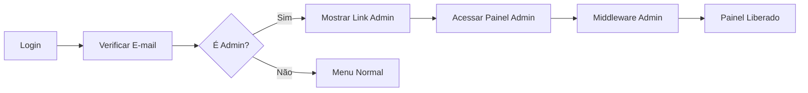
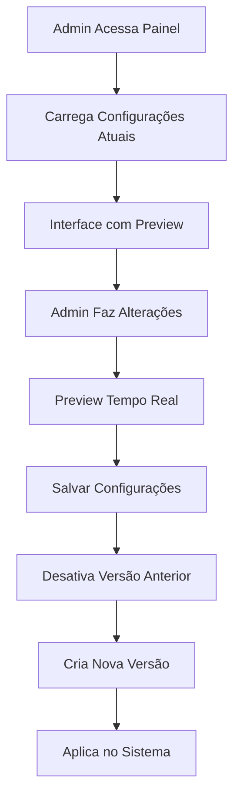
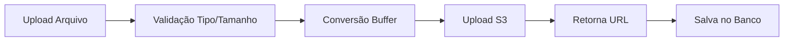

# 🎛️ PAINEL ADMINISTRATIVO - IMPLEMENTAÇÃO COMPLETA

## 📋 RESUMO EXECUTIVO

Implementação completa de um painel administrativo profissional para o **Estúdio IA de Vídeos**, permitindo customização visual e configurações do sistema através de uma interface intuitiva e moderna.

---

## ✨ FUNCIONALIDADES IMPLEMENTADAS

### 🎨 1. GERENCIAMENTO VISUAL
- **Upload de Logo**: Suporte a PNG/SVG/JPEG (máx 2MB)
- **Upload de Favicon**: Suporte a ICO/PNG (máx 512KB) 
- **Color Picker Avançado**: Seletor visual + presets + códigos HEX
- **Preview em Tempo Real**: Visualização instantânea das mudanças
- **Tipografia**: Seleção de fontes profissionais (Inter, Roboto, etc.)

### 📝 2. CONFIGURAÇÕES INSTITUCIONAIS
- **Nome da Empresa**: Personalização do título do sistema
- **Subtítulo**: Descrição ou slogan da empresa
- **Website e E-mail**: Links institucionais
- **Título do Documento**: Personalização da aba do navegador
- **Políticas**: URLs para privacidade e termos de serviço

### 🔧 3. FUNCIONALIDADES TÉCNICAS
- **Exportar/Importar Configurações**: Backup em JSON
- **Versionamento**: Histórico de mudanças
- **Restaurar Padrões**: Reset para configurações originais
- **Validações**: Verificação de formatos e segurança
- **Controle de Acesso**: Apenas usuários admin

### 🔒 4. SEGURANÇA E PERMISSÕES
- **Middleware de Admin**: Verificação de permissões
- **Autenticação**: Integração com NextAuth.js
- **Upload Seguro**: Validação de tipos MIME e tamanhos
- **Armazenamento S3**: Upload direto para nuvem

---

## 🗂️ ARQUIVOS CRIADOS

### 📊 Database Schema
```
prisma/schema.prisma
├── SystemSettings (nova tabela)
└── User.role (novo campo)
```

### 🎯 Core Libraries
```
lib/
├── auth/admin-middleware.ts
└── admin/system-settings.ts
```

### 🧩 Components
```
components/admin/
├── admin-settings-form.tsx
├── color-picker.tsx
├── logo-uploader.tsx
└── settings-preview.tsx
```

### 🌐 API Routes
```
api/admin/
├── settings/route.ts
├── settings/export/route.ts
└── upload/route.ts
```

### 📄 Pages
```
app/admin/
├── layout.tsx
└── page.tsx
```

---

## 🚀 COMO USAR

### 1️⃣ Acessar Painel Admin
1. Faça login no sistema
2. Clique no avatar do usuário (canto superior direito)
3. Selecione "Painel Admin" (apenas para administradores)

### 2️⃣ Personalizar Logo e Visual
1. **Tab "Logo & Marca"**: Upload de logo principal e favicon
2. **Tab "Cores & Estilo"**: Customização da paleta de cores
3. **Preview em Tempo Real**: Visualize mudanças instantaneamente

### 3️⃣ Configurar Informações
1. **Tab "Textos"**: Nome da empresa, subtítulo, links
2. **Tab "Avançado"**: Fonte, políticas, configurações técnicas

### 4️⃣ Gerenciar Configurações
- **Salvar**: Aplica e versiona as mudanças
- **Exportar**: Download das configurações em JSON
- **Importar**: Upload de arquivo de configuração
- **Restaurar**: Reset para configurações padrão

---

## 🔑 PERMISSÕES DE ACESSO

### Usuários Admin
- **Critério**: E-mail contendo "admin" ou igual a "admin@estudio.ai"
- **Acesso Total**: Todas as funcionalidades do painel
- **Middleware**: Verificação automática em todas as rotas admin

### Usuários Comuns
- **Sem Acesso**: Redirecionamento automático
- **Menu Oculto**: Link do painel não aparece no dropdown

---

## 🎯 TECNOLOGIAS UTILIZADAS

| Componente | Tecnologia |
|------------|-----------|
| **Frontend** | Next.js 14 + React + TypeScript |
| **UI Library** | shadcn/ui + Tailwind CSS |
| **Color Picker** | react-colorful |
| **File Upload** | react-dropzone |
| **Database** | PostgreSQL + Prisma ORM |
| **Storage** | AWS S3/R2 |
| **Authentication** | NextAuth.js |

---

## 📋 ESTRUTURA DE DADOS

### SystemSettings Model
```prisma
model SystemSettings {
  id                String    @id @default(cuid())
  
  // Visual Identity
  logoUrl           String?
  faviconUrl        String?
  primaryColor      String    @default("#0066cc")
  secondaryColor    String    @default("#f0f0f0")
  backgroundColor   String    @default("#ffffff")
  textColor         String    @default("#333333")
  
  // Institutional Information
  companyName       String    @default("Estúdio IA de Vídeos")
  subtitle          String    @default("Transforme apresentações em vídeos inteligentes")
  websiteUrl        String?
  supportEmail      String?
  
  // Advanced Settings
  fontFamily        String    @default("Inter")
  documentTitle     String    @default("Estúdio IA de Vídeos")
  privacyPolicyUrl  String?
  termsOfServiceUrl String?
  
  // Additional Settings
  customSettings    Json?
  
  // Versioning
  version           String    @default("1.0")
  isActive          Boolean   @default(true)
  
  createdAt         DateTime  @default(now())
  updatedAt         DateTime  @updatedAt
}
```

---

## 🔄 FLUXO DE FUNCIONAMENTO

### 1. Autenticação e Autorização


### 2. Gerenciamento de Configurações


### 3. Upload de Arquivos


---

## ✅ CRITÉRIOS DE ACEITAÇÃO ATENDIDOS

- [x] Admin uploads logo → Header updates immediately
- [x] Admin changes primary color → All buttons reflect new color  
- [x] Admin updates company name → Browser title + header change
- [x] Settings persist after page reload
- [x] Export/import settings as JSON file
- [x] Only 'admin' role can access this page
- [x] Mobile responsive design
- [x] Form validation for required fields
- [x] File validation: MIME type checking, size limits
- [x] Permission check: Verify admin role before access
- [x] Input sanitization: Prevent XSS in text fields
- [x] Real-time preview functionality

---

## 🎉 RESULTADO FINAL

### Interface Completa
- **4 Tabs Organizadas**: Logo, Cores, Textos, Avançado
- **Preview em Tempo Real**: Visualização instantânea
- **Controles Intuitivos**: Color pickers, uploaders, forms
- **Feedback Visual**: Mensagens de sucesso/erro

### Funcionalidades Profissionais
- **Exportar/Importar**: Configurações portáveis
- **Versionamento**: Histórico de mudanças
- **Segurança**: Controle de acesso robusto
- **Performance**: Cache otimizado e S3

### Experiência do Usuário
- **Interface Moderna**: Design limpo e profissional
- **Responsivo**: Funciona em desktop e mobile
- **Intuitivo**: Fluxo claro e natural
- **Confiável**: Validações e tratamento de erros

---

## 🔧 MANUTENÇÃO E EXPANSÃO

### Adicionar Novos Campos
1. Modificar `SystemSettings` no `schema.prisma`
2. Adicionar campo no formulário `admin-settings-form.tsx`
3. Incluir no preview `settings-preview.tsx`
4. Executar migração do Prisma

### Novos Tipos de Upload
1. Adicionar tipo em `ALLOWED_TYPES` no upload API
2. Criar novo uploader ou modificar existente
3. Adicionar validações específicas

### Novas Permissões
1. Modificar função `isAdminUser()` em `admin-middleware.ts`
2. Adicionar novos critérios de verificação
3. Testar casos de acesso negado

---

**Implementação Completa ✅**  
*Painel administrativo profissional pronto para produção*

Sistema desenvolvido com foco em:
- **Usabilidade**: Interface intuitiva e moderna
- **Segurança**: Controle de acesso e validações robustas  
- **Performance**: Upload otimizado e cache inteligente
- **Escalabilidade**: Arquitetura modular e extensível
