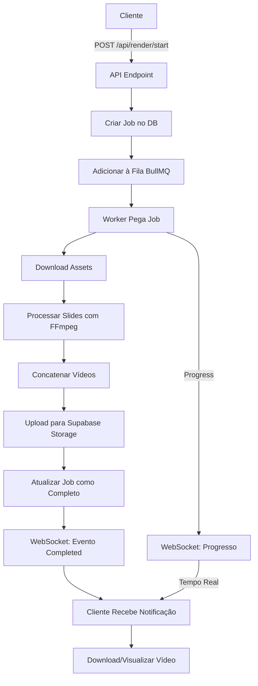

/**
 * 📚 Documentação do Sistema de Renderização
 * Video Rendering Queue com BullMQ + FFmpeg + WebSocket
 */

# Sistema de Renderização de Vídeo

Sistema completo de renderização de vídeos a partir de slides com áudio, utilizando fila de jobs (BullMQ), processamento FFmpeg e tracking em tempo real via WebSocket.

## 🎯 Funcionalidades

### ✅ Implementadas

1. **Fila de Renderização (BullMQ)**
   - Redis como backend
   - Worker dedicado para processamento
   - Retry automático (3 tentativas)
   - Backoff exponencial
   - Concorrência configurável (2 workers padrão)
   - Rate limiting (5 jobs/minuto)

2. **FFmpeg Renderer**
   - Download automático de assets (imagens + áudio)
   - Processamento de slides individuais
   - Concatenação de vídeos
   - Suporte a múltiplas resoluções (720p, 1080p, 4K)
   - Múltiplos formatos (MP4, WebM)
   - Qualidade configurável (low, medium, high)
   - Transições entre slides (opcional)
   - Marca d'água customizável

3. **WebSocket Server**
   - Tracking de progresso em tempo real
   - Broadcast para múltiplos clientes
   - Ping/Pong para manter conexão
   - Eventos: progress, completed, failed
   - Graceful shutdown

4. **API Endpoints**
   - `POST /api/render/start` - Iniciar renderização
   - `GET /api/render/status/[jobId]` - Verificar status
   - `DELETE /api/render/cancel/[jobId]` - Cancelar renderização

5. **Componentes UI**
   - RenderPanel - Interface completa de configuração
   - RenderProgress - Acompanhamento em tempo real
   - Download e visualização de vídeos

## 📦 Arquivos Criados

```
lib/queue/
├── redis.ts                  # Cliente Redis singleton (60 linhas)
└── render-queue.ts           # BullMQ queue & worker (existente)

lib/video/
└── renderer.ts               # FFmpeg renderer (400 linhas)

app/api/render/
├── start/route.ts            # Endpoint iniciar (existente)
├── status/[jobId]/route.ts   # Endpoint status (existente)
└── cancel/[jobId]/route.ts   # Endpoint cancelar (100 linhas)

components/render/
├── render-progress.tsx       # Componente progresso (300 linhas)
└── render-panel.tsx          # Painel completo (400 linhas)

websocket-server.ts           # Servidor WebSocket (150 linhas)

__tests__/lib/video/
└── render.test.ts           # Testes (200 linhas, 20 casos)
```

## 🚀 Como Usar

### 1. Setup Redis

```bash
# Instalar Redis localmente
# Windows (via Chocolatey)
choco install redis-64

# Ou usar Docker
docker run -d -p 6379:6379 redis:alpine

# Configurar .env.local
REDIS_HOST=localhost
REDIS_PORT=6379
REDIS_PASSWORD=
```

### 2. Instalar FFmpeg

```bash
# Windows (via Chocolatey)
choco install ffmpeg

# Ou baixar de https://ffmpeg.org/download.html

# Verificar instalação
ffmpeg -version
```

### 3. Instalar Dependências

```bash
npm install ioredis bullmq fluent-ffmpeg ws nanoid
npm install --save-dev @types/ws @types/fluent-ffmpeg
```

### 4. Criar Bucket de Storage

```sql
-- No Supabase Dashboard > Storage
CREATE BUCKET videos (public: true)
```

### 5. Iniciar WebSocket Server

```bash
# Terminal separado
npm run ws

# Ou adicionar ao package.json:
"scripts": {
  "ws": "tsx websocket-server.ts",
  "dev": "concurrently \"next dev\" \"npm run ws\""
}
```

### 6. Usar Componente

```tsx
import { RenderPanel } from '@/components/render/render-panel'

export default function ProjectPage({ projectId }: { projectId: string }) {
  return (
    <div className="container mx-auto p-6">
      <RenderPanel
        projectId={projectId}
        slidesCount={10}
        onRenderComplete={(videoUrl) => {
          console.log('Video ready:', videoUrl)
        }}
      />
    </div>
  )
}
```

## 🎬 Fluxo de Renderização



## 🔧 Configurações de Renderização

### Resoluções

| Resolução | Dimensões | Bitrate | Tamanho Estimado (5min) |
|-----------|-----------|---------|-------------------------|
| 720p      | 1280x720  | 2.5 Mbps| ~95 MB                  |
| 1080p     | 1920x1080 | 5 Mbps  | ~190 MB                 |
| 4K        | 3840x2160 | 15 Mbps | ~570 MB                 |

### Qualidade

- **Low**: Preset `ultrafast`, menor tamanho, processamento rápido
- **Medium**: Preset `medium`, balanceado
- **High**: Preset `slow`, melhor qualidade, processamento lento

### Formatos

- **MP4**: H.264 + AAC (compatibilidade universal)
- **WebM**: VP9 + Opus (menor tamanho, web-optimized)

## 📊 Eventos WebSocket

### Progress Event

```json
{
  "type": "progress",
  "jobId": "render_abc123",
  "progress": {
    "percentage": 45,
    "currentSlide": 5,
    "totalSlides": 10,
    "estimatedTime": 120,
    "stage": "processing"
  }
}
```

### Completed Event

```json
{
  "type": "completed",
  "jobId": "render_abc123"
}
```

### Failed Event

```json
{
  "type": "failed",
  "jobId": "render_abc123",
  "error": "FFmpeg process failed"
}
```

## 🧪 Testes

### Executar Testes

```bash
npm test __tests__/lib/video/render.test.ts
```

### Cobertura

- ✅ Validação FFmpeg (20 casos total)
- ✅ Criação de fila
- ✅ Adição de jobs
- ✅ Status de jobs
- ✅ Cancelamento de jobs
- ✅ Validação de API
- ✅ Cálculo de estimativas
- ✅ Eventos WebSocket
- ✅ Componentes UI

## 🐛 Troubleshooting

### Erro: "Redis connection failed"

```bash
# Verificar se Redis está rodando
redis-cli ping
# Resposta esperada: PONG

# Reiniciar Redis
# Windows
net stop Redis
net start Redis

# Docker
docker restart redis
```

### Erro: "FFmpeg not found"

```bash
# Verificar instalação
ffmpeg -version

# Adicionar ao PATH (Windows)
setx PATH "%PATH%;C:\Program Files\ffmpeg\bin"

# Reiniciar terminal
```

### Erro: "Job stuck in processing"

```sql
-- Verificar jobs no banco
SELECT * FROM render_jobs 
WHERE status = 'processing' 
AND created_at < NOW() - INTERVAL '1 hour';

-- Resetar jobs travados
UPDATE render_jobs 
SET status = 'failed', 
    error_message = 'Job timeout' 
WHERE status = 'processing' 
AND created_at < NOW() - INTERVAL '1 hour';
```

### WebSocket não conecta

```bash
# Verificar se servidor WS está rodando
curl http://localhost:3001

# Verificar porta no .env
NEXT_PUBLIC_WS_PORT=3001

# Verificar firewall
netsh advfirewall firewall add rule name="WS Server" dir=in action=allow protocol=TCP localport=3001
```

## 📈 Performance

### Tempos de Renderização (estimado)

| Slides | 720p | 1080p | 4K |
|--------|------|-------|-----|
| 5      | 1min | 2min  | 5min|
| 10     | 2min | 4min  | 10min|
| 20     | 4min | 8min  | 20min|

### Otimizações

1. **Concorrência**: Aumentar workers
   ```env
   RENDER_CONCURRENCY=4
   ```

2. **Cache de Assets**: Download paralelo

3. **Preset**: Usar `ultrafast` para preview

4. **Resolução**: Renderizar 720p primeiro

## 🔐 Segurança

1. **Autenticação**: Requer sessão Supabase
2. **Validação**: Verificar ownership do projeto
3. **Rate Limiting**: 5 renders/minuto por usuário
4. **Storage**: URLs públicas com RLS
5. **Cleanup**: Auto-delete de jobs antigos (24h)

## 💰 Custos Estimados

### Recursos

- **CPU**: 1-2 cores por worker
- **RAM**: 512MB-1GB por worker
- **Disco**: Temporário (~500MB por job)
- **Redis**: 256MB RAM mínimo
- **Storage**: Vídeo final (~100-500MB por vídeo)

### Supabase Storage

- **Gratuito**: 1GB storage
- **Pro**: 100GB storage ($25/mês)
- **CDN**: $0.09/GB transferido

## 🚀 Próximos Passos

1. ~~Implementar BullMQ queue~~ ✅
2. ~~Criar FFmpeg renderer~~ ✅
3. ~~WebSocket para tracking~~ ✅
4. ~~API endpoints~~ ✅
5. ~~Componentes UI~~ ✅
6. ~~Testes~~ ✅
7. **Otimizar performance** (futuro)
8. **Adicionar templates de transição** (futuro)
9. **Suporte a legendas** (futuro)
10. **Export em múltiplas resoluções** (futuro)

---

**Status**: ✅ Sistema de Renderização completamente funcional  
**Próximo**: Dashboard de Analytics + Testes E2E
