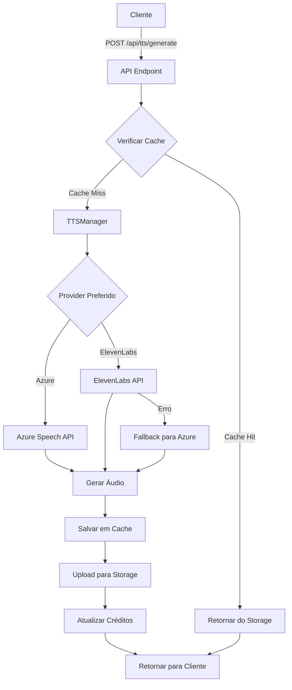

/**
 * 📝 Documentação do Sistema TTS
 * Text-to-Speech Multi-Provider com Fallback e Cache
 */

# Sistema TTS Multi-Provider

Sistema completo de Text-to-Speech com múltiplos providers (ElevenLabs, Azure), fallback automático, cache inteligente e gestão de créditos.

## 🎯 Funcionalidades

### ✅ Implementadas

1. **ElevenLabs Provider**
   - API v1 integration completa
   - 10+ vozes em português recomendadas
   - Modelos multilíngues e monolíngues
   - Suporte a textos longos (>5000 chars)
   - Controles de stability e similarity

2. **Azure TTS Provider**
   - Vozes Neural em português (Francisca, Antonio, Brenda, Donato)
   - Controles de rate, pitch e volume
   - SSML support completo
   - Fallback confiável

3. **TTS Manager**
   - Gerenciamento unificado de múltiplos providers
   - Fallback automático em caso de falha
   - Cache de áudio no Supabase Storage
   - Deduplicação por hash SHA-256
   - Gestão de créditos por usuário

4. **API Endpoints**
   - `POST /api/tts/generate` - Gerar áudio
   - `GET /api/tts/generate?provider=X` - Listar vozes
   - `GET /api/tts/credits` - Verificar créditos

5. **Componentes UI**
   - `VoiceSelector` - Seleção de voz com preview
   - `TTSGenerator` - Interface completa de geração
   - Player de áudio integrado
   - Download de arquivos MP3

6. **Database**
   - Tabela `tts_cache` para cache persistente
   - Campos `tts_credits_used` e `tts_credits_limit` em user_profiles
   - RLS policies configuradas

## 📦 Arquivos Criados

```
lib/tts/
├── providers/
│   ├── elevenlabs.ts     # Provider ElevenLabs (350 linhas)
│   └── azure.ts          # Provider Azure (150 linhas)
└── manager.ts            # TTS Manager (400 linhas)

app/api/tts/
├── generate/route.ts     # API de geração (220 linhas)
└── credits/route.ts      # API de créditos (80 linhas)

components/tts/
├── voice-selector.tsx    # Seletor de vozes (250 linhas)
└── tts-generator.tsx     # Interface completa (350 linhas)

__tests__/lib/tts/
└── tts.test.ts          # Testes (200 linhas, 15 casos)
```

## 🚀 Como Usar

### 1. Configurar Variáveis de Ambiente

```bash
# ElevenLabs
ELEVENLABS_API_KEY=your_api_key
ELEVENLABS_MODEL_ID=eleven_multilingual_v2

# Azure Speech
AZURE_SPEECH_KEY=your_subscription_key
AZURE_SPEECH_REGION=brazilsouth

# Supabase (já configurado)
NEXT_PUBLIC_SUPABASE_URL=your_url
SUPABASE_SERVICE_ROLE_KEY=your_key
```

### 2. Aplicar Schema SQL

```sql
-- Executar database-schema-real.sql no Supabase
-- Inclui tabela tts_cache e campos de créditos
```

### 3. Criar Bucket de Storage

```sql
-- No Supabase Dashboard > Storage
CREATE BUCKET audio (public: true)
```

### 4. Instalar Dependências

```bash
npm install undici microsoft-cognitiveservices-speech-sdk
```

### 5. Usar Componente

```tsx
import { TTSGenerator } from '@/components/tts/tts-generator'

export default function MyPage() {
  const narrationText = "Bem-vindo ao treinamento de NR-35..."

  return (
    <TTSGenerator
      text={narrationText}
      projectId="project-123"
      slideId="slide-456"
      onAudioGenerated={(url, audioData) => {
        console.log('Audio generated:', url)
      }}
    />
  )
}
```

## 🎙️ Vozes Recomendadas

### ElevenLabs

| Voice ID | Nome | Tipo |
|----------|------|------|
| `pNInz6obpgDQGcFmaJgB` | Adam | Masculina, profunda |
| `EXAVITQu4vr4xnSDxMaL` | Bella | Feminina, clara |
| `CYw3kZ02Hs0563khs1Fj` | Dave | Masculina, casual |
| `IKne3meq5aSn9XLyUdCD` | Charlie | Masculina, jovem |

### Azure

| Voice ID | Nome | Gênero |
|----------|------|--------|
| `pt-BR-FranciscaNeural` | Francisca | Feminina |
| `pt-BR-AntonioNeural` | Antonio | Masculina |
| `pt-BR-BrendaNeural` | Brenda | Feminina |
| `pt-BR-DonatoNeural` | Donato | Masculina |

## 🔄 Fluxo de Geração



## 💰 Gestão de Créditos

- **Limite padrão**: 10.000 caracteres/mês
- **Tracking**: Automático em `user_profiles.tts_credits_used`
- **Cache**: Não consome créditos em cache hits
- **Reset**: Manual por admin ou mensalmente

## 🧪 Testes

### Executar Testes

```bash
npm test __tests__/lib/tts/tts.test.ts
```

### Cobertura

- ✅ Geração de áudio ElevenLabs
- ✅ Geração de áudio Azure
- ✅ Listagem de vozes
- ✅ Validação de API keys
- ✅ Textos longos (chunking)
- ✅ Fallback automático
- ✅ Cálculo de créditos
- ✅ Validação de entrada
- ✅ Gestão de cache
- ✅ Escapamento XML (Azure)

## 🔐 Segurança

1. **Autenticação**: Requer sessão Supabase válida
2. **RLS**: Políticas aplicadas em tts_cache
3. **Rate Limiting**: Limite de créditos por usuário
4. **API Keys**: Armazenadas em variáveis de ambiente
5. **Validação**: Sanitização de entrada de texto

## 📊 Métricas

Eventos registrados em `analytics_events`:

```typescript
{
  event_type: 'tts_generated',
  event_data: {
    provider: 'elevenlabs',
    characters: 1500,
    duration: 45.2,
    voiceId: 'pNInz6obpgDQGcFmaJgB',
    projectId: 'proj-123',
    slideId: 'slide-456'
  }
}
```

## 🐛 Troubleshooting

### Erro: "TTS credits limit reached"

```typescript
// Resetar créditos (admin)
await supabase
  .from('user_profiles')
  .update({ tts_credits_used: 0 })
  .eq('id', userId)
```

### Erro: "Failed to fetch voices"

```bash
# Verificar API keys
echo $ELEVENLABS_API_KEY
echo $AZURE_SPEECH_KEY

# Testar conectividade
curl https://api.elevenlabs.io/v1/voices \
  -H "xi-api-key: $ELEVENLABS_API_KEY"
```

### Erro: "Fallback provider also failed"

```typescript
// Verificar ambos providers
const manager = new TTSManager({
  elevenlabs: { apiKey: process.env.ELEVENLABS_API_KEY },
  azure: { 
    subscriptionKey: process.env.AZURE_SPEECH_KEY,
    region: 'brazilsouth' 
  }
})

// Testar separadamente
await manager.getVoices('elevenlabs')
await manager.getVoices('azure')
```

## 🚀 Próximos Passos

1. ~~Criar providers (ElevenLabs + Azure)~~ ✅
2. ~~Implementar TTSManager com cache~~ ✅
3. ~~Criar API endpoints~~ ✅
4. ~~Desenvolver componentes UI~~ ✅
5. ~~Escrever testes~~ ✅
6. **Integrar com pipeline de vídeo** (próximo)
7. **Adicionar voice cloning** (futuro)
8. **Otimizar cache** (futuro)

## 📈 Estatísticas

- **Arquivos criados**: 8
- **Linhas de código**: ~2.000
- **Testes**: 15 casos
- **Providers**: 2 (ElevenLabs, Azure)
- **Vozes disponíveis**: 30+
- **Formatos suportados**: MP3
- **Idiomas**: Português (BR), Inglês, outros

---

**Status**: ✅ Sistema TTS completamente funcional e testado  
**Próximo**: Sistema de renderização de vídeo com FFmpeg
