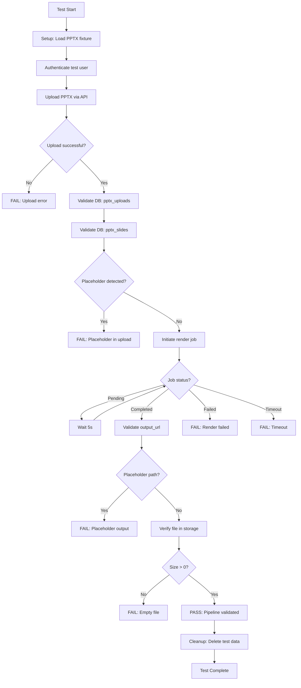

# Design: E2E PPTX-to-Video Pipeline Testing Architecture

## System Context

The PPTX-to-video pipeline is the core value proposition of the CursosTecno platform. It transforms PowerPoint presentations into narrated video courses through:

1. **Upload & Extraction** (`/api/v1/pptx/upload`): Parses PPTX files, extracts slides, text, and metadata
2. **Database Persistence**: Stores upload metadata in `pptx_uploads` and individual slides in `pptx_slides`
3. **Rendering Pipeline** (`/api/render/start`): Orchestrates TTS generation, video composition, and encoding
4. **Storage Integration**: Persists final video files to cloud storage (Supabase Storage/S3)

## Testing Strategy

### Layered Testing Approach

This change focuses on **Integration/E2E layer**, complementing existing:

- **Unit tests**: Individual service methods (PPTXProcessor, RenderService)
- **Contract tests**: API endpoint contracts
- **Component tests**: UI component behavior

### E2E Test Scope

```
┌─────────────────────────────────────────────────────────────┐
│                     E2E Test Boundary                        │
│                                                               │
│  ┌──────────┐      ┌──────────┐      ┌──────────┐          │
│  │  Upload  │─────▶│ Database │─────▶│ Rendering│          │
│  │   API    │      │   Layer  │      │   Queue  │          │
│  └──────────┘      └──────────┘      └──────────┘          │
│       │                                     │                │
│       │                                     ▼                │
│       │                              ┌──────────┐           │
│       └─────────────────────────────▶│ Storage  │           │
│                                       └──────────┘           │
│                                                               │
│  Validates: API → DB → Queue → Worker → Storage → DB        │
└─────────────────────────────────────────────────────────────┘
```

### No Mocking Philosophy

**Critical Design Principle**: This E2E test uses ZERO mocks for:

- Database operations (real Supabase/PostgreSQL)
- Storage operations (real Supabase Storage/S3)
- Queue operations (real BullMQ/Redis)
- Rendering pipeline (real FFmpeg/Remotion)

**Rationale**: The goal is to catch integration failures that unit tests miss, such as:
- Database schema mismatches
- Storage permission errors
- Queue serialization bugs
- Pipeline orchestration race conditions

### Placeholder Detection

**Anti-Pattern Detection**: The test actively validates that responses are NOT placeholders:

```typescript
// Example validation logic
function isPlaceholderPath(path: string): boolean {
  const placeholderPatterns = [
    /fake/i,
    /placeholder/i,
    /mock/i,
    /example/i,
    /test\.mp4$/,
    /dummy/i,
  ];
  return placeholderPatterns.some(pattern => pattern.test(path));
}
```

**Validation Points**:
1. `processingId` from upload response → Must be UUID or timestamp-based
2. Database records → Must have real timestamps, not `1970-01-01`
3. `output_url` from render job → Must point to actual storage path
4. File size → Must be > 0 bytes (preferably > 100KB for a real video)

## Test Architecture

### Test File Structure

```
estudio_ia_videos/src/app/e2e/
├── pptx-to-video-real.spec.ts         # Main E2E test
├── fixtures/
│   └── test-presentation.pptx          # Test PPTX file (2-3 slides)
└── helpers/
    └── pptx-pipeline.helpers.ts        # Reusable utilities
```

### Test Flow Diagram



## Database Integration

### Tables Involved

1. **pptx_uploads**: Main upload record
   ```sql
   SELECT id, projectId, original_filename, status, slide_count, createdAt 
   FROM pptx_uploads 
   WHERE id = ?;
   ```

2. **pptx_slides**: Individual slides
   ```sql
   SELECT id, upload_id, slide_number, title, content, duration, thumbnailUrl 
   FROM pptx_slides 
   WHERE upload_id = ?;
   ```

3. **render_jobs**: Video rendering status
   ```sql
   SELECT id, projectId, status, progress, output_url, error_message, createdAt, completed_at 
   FROM render_jobs 
   WHERE id = ?;
   ```

### Data Validation Strategy

**Post-Upload Checks**:
- `pptx_uploads.status = 'completed'`
- `pptx_uploads.slide_count > 0`
- `pptx_slides` count matches `pptx_uploads.slide_count`
- All slides have non-null `slideNumber`, `content`, `duration`

**Post-Render Checks**:
- `render_jobs.status = 'completed'`
- `render_jobs.output_url IS NOT NULL`
- `render_jobs.completed_at > render_jobs.started_at`
- `render_jobs.error_message IS NULL`

## Storage Integration

### Storage Access Pattern

```typescript
// Pseudo-code for storage validation
async function validateVideoFile(outputUrl: string): Promise<{exists: boolean, size: number}> {
  // Extract storage path from URL
  const storagePath = parseStoragePath(outputUrl);
  
  // Query storage backend (Supabase Storage API)
  const { data, error } = await supabase.storage
    .from('videos')
    .download(storagePath);
  
  if (error || !data) {
    return { exists: false, size: 0 };
  }
  
  return { exists: true, size: data.size };
}
```

### Storage Validation Rules

1. **Existence**: File must exist at `output_url` path
2. **Size**: File size must be > 0 bytes (preferably > 100KB)
3. **Format**: File extension should be `.mp4` or configured video format
4. **Accessibility**: File must be downloadable (permissions correct)

## CI/CD Integration

### Workflow Design

**Option 1: Separate E2E Job** (Recommended)
```yaml
jobs:
  e2e-pipeline:
    name: E2E PPTX Pipeline
    runs-on: ubuntu-latest
    needs: [build, tests]
    steps:
      - Install Playwright
      - Seed test database (if needed)
      - Run E2E test
      - Upload artifacts (report, video file)
      - Cleanup test data
```

**Option 2: Matrix Integration**
- Add `e2e-pptx-pipeline` to existing `tests` job matrix
- Shares infrastructure with other E2E tests
- Longer overall CI runtime but simpler workflow

### CI Environment Configuration

Required environment variables:
```bash
DATABASE_URL=postgresql://...          # Test database
SUPABASE_URL=https://...               # Storage backend
SUPABASE_SERVICE_ROLE_KEY=...          # Admin access for cleanup
REDIS_URL=redis://...                   # Queue backend
E2E_TEST_USER_EMAIL=test@example.com   # Pre-seeded test user
E2E_TEST_USER_PASSWORD=...             # Test user password
```

### Performance Considerations

| Factor | Estimated Time | Mitigation |
|--------|---------------|------------|
| PPTX Upload | 1-2s | Use small test file (2-3 slides) |
| Slide Processing | 2-5s | Minimal slide content |
| Rendering (2 slides) | 30-60s | Consider shorter slides (5s each) |
| Polling Overhead | 10-20s | Exponential backoff polling |
| Storage Upload | 3-5s | Compress video with lower quality for tests |
| **Total** | **~50-100s** | Run in separate CI job, nightly builds |

## Error Handling & Debugging

### Failure Scenarios

1. **Upload Failure**: PPTX validation error, storage quota exceeded
2. **Processing Failure**: Corrupt PPTX, unsupported content types
3. **Render Failure**: Missing TTS credentials, FFmpeg error, queue timeout
4. **Storage Failure**: Permission denied, network error, quota exceeded
5. **Placeholder Detection**: API returns mock data instead of real output

### Debugging Aids

**Playwright Trace**: Capture full browser interaction
```bash
npx playwright test --trace on
```

**Verbose Logging**: Enable debug logs in test
```typescript
test.use({ video: 'on', screenshot: 'on' });
logger.setLevel('debug');
```

**Database Snapshots**: Log DB state at each checkpoint
```typescript
await logDatabaseState('pptx_uploads', uploadId);
await logDatabaseState('render_jobs', jobId);
```

## Rollback & Cleanup Strategy

### Test Data Cleanup

**Option A: Automatic Cleanup** (Recommended)
```typescript
test.afterEach(async () => {
  // Delete test records in dependency order
  await db.delete('pptx_slides').where({ upload_id: testUploadId });
  await db.delete('pptx_uploads').where({ id: testUploadId });
  await db.delete('render_jobs').where({ id: testJobId });
  await storage.delete(testVideoPath);
});
```

**Option B: Test Database**
- Use dedicated `test` schema or database
- Truncate all tables before/after test runs
- Avoids affecting production/development data

### Orphaned Data Detection

Run periodic cleanup script:
```sql
-- Find uploads older than 1 hour with status='pending'
SELECT id FROM pptx_uploads 
WHERE status='pending' AND createdAt < NOW() - INTERVAL '1 hour';

-- Find render jobs stuck in processing
SELECT id FROM render_jobs 
WHERE status='processing' AND started_at < NOW() - INTERVAL '1 hour';
```

## Extensibility

### Future Enhancements

1. **Multi-format support**: Test with different PPTX content types (images, charts, animations)
2. **Performance benchmarks**: Track rendering time, measure regressions
3. **Stress testing**: Upload multiple files concurrently, test queue capacity
4. **Error injection**: Simulate failures (network errors, storage quota, etc.) to test resilience
5. **Visual regression**: Compare generated video frames against baseline

### Related Capabilities

This E2E test validates the integration between:
- PPTX processing capability (separate spec)
- Video rendering capability (separate spec)
- Storage management capability (separate spec)
- Queue orchestration capability (separate spec)

Each capability may have its own specs; this E2E test ensures they work together correctly.
